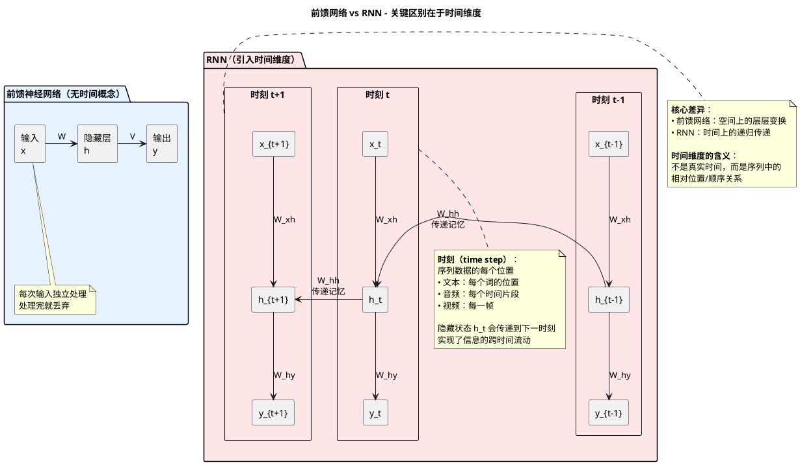
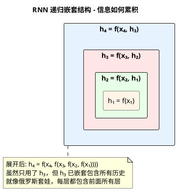
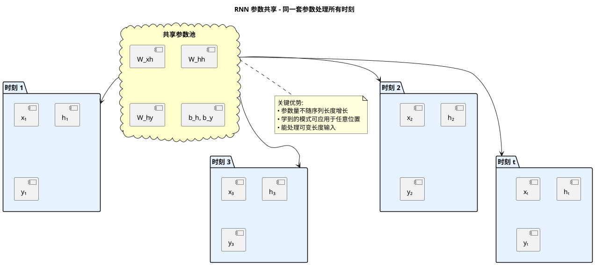

# RNN（循环神经网络）

## 什么是RNN？

RNN (Recurrent Neural Network，循环神经网络) 是一种专门用于处理**序列数据**的神经网络。与传统前馈神经网络不同，RNN具有"记忆"能力，能够利用之前时间步的信息来影响当前的输出。

### RNN vs 前馈网络：时间维度的引入



## 基本原理

### 核心思想

RNN的关键在于**隐藏状态**（Hidden State）的循环连接：
- 当前时刻的隐藏状态不仅依赖于当前输入，还依赖于上一时刻的隐藏状态
- 这种循环结构使得网络能够保持对历史信息的"记忆"

### 数学表示

在时刻 $t$，RNN的计算过程如下：

#### 隐藏状态更新
$$h_t = \tanh(W_{hh} \cdot h_{t-1} + W_{xh} \cdot x_t + b_h)$$

#### 输出计算
$$y_t = W_{hy} \cdot h_t + b_y$$

**参数说明：**
- $x_t$: 时刻 $t$ 的输入
- $h_t$: 时刻 $t$ 的隐藏状态
- $h_{t-1}$: 上一时刻的隐藏状态
- $y_t$: 时刻 $t$ 的输出
- $W_{hh}$: 隐藏状态到隐藏状态的权重矩阵
- $W_{xh}$: 输入到隐藏状态的权重矩阵
- $W_{hy}$: 隐藏状态到输出的权重矩阵
- $b_h, b_y$: 偏置项

### 为什么这样能产生记忆能力？

RNN的记忆能力源于其**循环结构**和**参数共享**机制：

#### 可视化：递归嵌套的"俄罗斯套娃"结构



#### 文字解释

1. **隐藏状态的累积效应**
   - 公式 $h_t = \tanh(W_{hh} \cdot h_{t-1} + W_{xh} \cdot x_t + b_h)$ 中，$h_{t-1}$ 包含了之前所有时刻的信息
   - 每个时刻的隐藏状态都会"融合"历史信息和当前输入
   - 就像"滚雪球"一样，信息不断累积传递
   
   **重要说明**：
   - RNN **只直接使用** $h_{t-1}$（上一时刻），而不是同时使用 $h_0, h_1, ..., h_{t-1}$ 所有历史
   - 但 $h_{t-1}$ **已经包含**了所有历史信息（因为它是递归计算得来的）
   - 这是**递归传递**，不是**并行输入**

2. **参数共享的意义**
   - 所有时间步使用**相同的权重矩阵** $W_{hh}$、$W_{xh}$、$W_{hy}$
   - 网络学会了一种"通用的记忆规则"，适用于序列的每个位置
   - 这使得网络能处理任意长度的序列
   
   **为什么要参数共享？通过对比来理解：**
   
   **❌ 不共享参数的做法（每个位置独立参数）**：
   ```
   时刻1: h₁ = tanh(W₁_hh·h₀ + W₁_xh·x₁ + b₁)
   时刻2: h₂ = tanh(W₂_hh·h₁ + W₂_xh·x₂ + b₂)
   时刻3: h₃ = tanh(W₃_hh·h₂ + W₃_xh·x₃ + b₃)
   ```
   **问题**：
   - 参数量随序列长度成倍增长（序列长100就要100套参数）
   - 无法处理训练时没见过的序列长度
   - 位置1学到的规律无法应用到位置2
   - 就像给每个位置配一个专属大脑，互不通用
   
   **✅ 参数共享的做法（所有位置用同一套参数）**：
   ```
   时刻1: h₁ = tanh(W_hh·h₀ + W_xh·x₁ + b_h)  ← 用同一套 W
   时刻2: h₂ = tanh(W_hh·h₁ + W_xh·x₂ + b_h)  ← 用同一套 W
   时刻3: h₃ = tanh(W_hh·h₂ + W_xh·x₃ + b_h)  ← 用同一套 W
   ```
   **优势**：
   - 参数量固定，不随序列长度变化
   - 训练时见过长度10的句子，也能处理长度1000的句子
   - 在位置1学会识别"动词"的规律，在位置100也能用
   - 就像一个大脑应对所有时刻，学到的技能可复用
   
   **类比理解**：
   - **不共享参数**：像给每个月配一个不同的日历App（1月用App1，2月用App2...），每个App都要重新学习怎么记事
   - **参数共享**：像用同一个日历App处理所有月份，学会一次就能永久使用

#### 可视化：参数共享机制



3. **信息流动路径**
   ```
   时刻 1: x₁ → h₁ (包含 x₁ 的信息)
   时刻 2: x₂ + h₁ → h₂ (包含 x₁, x₂ 的信息)
   时刻 3: x₃ + h₂ → h₃ (包含 x₁, x₂, x₃ 的信息)
   ...
   时刻 t: xₜ + hₜ₋₁ → hₜ (包含 x₁...xₜ 的所有历史)
   ```
   
   **递归传递过程详解**：
   ```
   h₁ = f(x₁)
   h₂ = f(x₂, h₁) = f(x₂, f(x₁))
   h₃ = f(x₃, h₂) = f(x₃, f(x₂, f(x₁)))
   h₄ = f(x₄, h₃) = f(x₄, f(x₃, f(x₂, f(x₁))))
   ```
   
   可以看到，虽然计算 $h_4$ 时只用了 $h_3$，但 $h_3$ 里面已经嵌套了 $h_2$，$h_2$ 里面嵌套了 $h_1$。
   这就像俄罗斯套娃，每一层都包含了之前所有层的信息。

**简单类比**：想象你在看一部连续剧，每一集（时刻 $t$）你都会：
- 看当前剧情（$x_t$）
- 回忆之前的剧情（$h_{t-1}$）
- 形成对整个故事的理解（$h_t$）

这种"当前输入 + 历史记忆 → 新的记忆"的循环机制，让RNN能够理解序列的上下文关系。

## 训练方法：BPTT

RNN使用**BPTT (Backpropagation Through Time，通过时间反向传播)** 进行训练：

1. 将RNN沿时间轴展开成深度网络
2. 使用标准反向传播算法计算梯度
3. 梯度需要从当前时刻反向传播到所有历史时刻

## 为什么有长期依赖问题？

### 问题本质

RNN在处理长序列时，难以学习距离较远的时间步之间的依赖关系。这主要源于**梯度消失**和**梯度爆炸**问题。

### 梯度消失问题详解

#### 1. 梯度传播链

在BPTT中，梯度需要通过多个时间步反向传播。假设我们要计算损失 $L$ 对 $t$ 时刻之前第 $k$ 个时间步的梯度：

$$\frac{\partial L}{\partial h_{t-k}} = \frac{\partial L}{\partial h_t} \cdot \prod_{i=1}^{k} \frac{\partial h_{t-i+1}}{\partial h_{t-i}}$$

#### 2. 雅可比矩阵连乘

每个 $\frac{\partial h_{t-i+1}}{\partial h_{t-i}}$ 是一个雅可比矩阵，其主要成分包含权重矩阵 $W_{hh}$ 和激活函数的导数：

$$\frac{\partial h_t}{\partial h_{t-1}} = W_{hh}^T \cdot \text{diag}(\tanh'(h_{t-1}))$$

#### 3. 梯度消失的数学原因

**当 $k$ 很大时（长距离依赖）：**

- **如果** $|W_{hh}| < 1$ 或 $|\tanh'| < 1$：
  - 连乘导致：$|W_{hh}|^k \to 0$
  - **梯度消失**：早期时间步的梯度趋近于0
  - **后果**：网络无法学习长期依赖

- **如果** $|W_{hh}| > 1$：
  - 连乘导致：$|W_{hh}|^k \to \infty$
  - **梯度爆炸**：梯度值变得极大
  - **后果**：训练不稳定，参数更新剧烈波动

### 直观理解

```
时间跨度越大 → 梯度传播路径越长 → 连乘次数越多
                                      ↓
                            |W| < 1: 梯度趋近0（消失）
                            |W| > 1: 梯度爆炸
```

### 具体例子

假设我们在分析句子："**我在法国长大**...（中间100个词）...**所以我说流利的法语**"

- RNN需要记住"法国"这个信息100个时间步
- 梯度需要反向传播100步才能更新"法国"相关的权重
- 经过100次矩阵连乘，梯度可能已经消失到接近0
- 网络无法学到"法国"和"法语"之间的关联

### tanh激活函数的影响

$$\tanh'(x) = 1 - \tanh^2(x)$$

- $\tanh'(x)$ 的最大值为1，通常远小于1
- 在梯度反向传播中，每经过一个时间步，梯度都会被 $\tanh'$ 缩小
- 经过多个时间步后，梯度指数级衰减

## RNN的局限性总结

| 问题 | 原因 | 影响 |
|------|------|------|
| 梯度消失 | 长距离梯度连乘导致指数衰减 | 无法学习长期依赖 |
| 梯度爆炸 | 权重矩阵特征值>1时连乘发散 | 训练不稳定 |
| 记忆容量有限 | 隐藏状态不断被覆盖 | 早期信息丢失 |
| 难以并行 | 序列计算依赖前一时刻 | 训练效率低 |

## RNN的应用场景

尽管有局限性，RNN在某些场景下仍然有效：

- ✅ **短序列任务**：文本分类、情感分析
- ✅ **时间序列预测**：股票价格、天气预报
- ✅ **序列标注**：词性标注、命名实体识别
- ✅ **语音识别**（短音频片段）

## 关键要点

1. **RNN的优势**：能够处理变长序列，具有参数共享和记忆能力
2. **核心缺陷**：长期依赖问题源于梯度的指数衰减或爆炸
3. **数学本质**：梯度反向传播时的矩阵连乘导致数值不稳定
4. **实践意义**：理解RNN的局限性是学习LSTM、GRU和Transformer的基础
