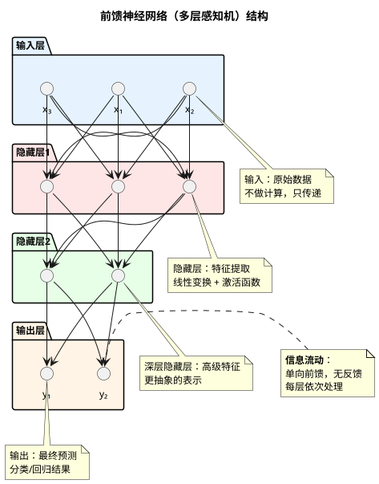

# 前馈神经网络（Feedforward Neural Network）

## 什么是前馈神经网络？

前馈神经网络（Feedforward Neural Network，FNN）是最基础、最经典的人工神经网络类型。也称为**多层感知机（MLP, Multi-Layer Perceptron）**。

**核心特点：**
- 信息单向流动：从输入层 → 隐藏层 → 输出层
- 无反馈连接：不存在循环或回路
- 无记忆能力：每次输入独立处理，不保留历史信息

## 网络结构

### 基本组成



### 层次结构

1. **输入层（Input Layer）**
   - 接收原始数据
   - 节点数 = 特征维度
   - 不进行计算，只传递数据

2. **隐藏层（Hidden Layers）**
   - 提取和转换特征
   - 可以有多层（深度神经网络）
   - 每层进行线性变换 + 非线性激活

3. **输出层（Output Layer）**
   - 产生最终预测结果
   - 节点数取决于任务类型
     - 二分类：1个节点
     - 多分类：K个节点（K=类别数）
     - 回归：1个或多个节点

## 数学原理

### 单个神经元的计算

一个神经元的工作过程：

```
输入: x₁, x₂, ..., xₙ
      ↓
加权求和: z = w₁x₁ + w₂x₂ + ... + wₙxₙ + b
      ↓
激活函数: a = f(z)
      ↓
输出: a
```

**数学表达式：**
$$z = \sum_{i=1}^{n} w_i x_i + b = \mathbf{w}^T \mathbf{x} + b$$
$$a = f(z)$$

**参数说明：**
- $\mathbf{x}$: 输入向量
- $\mathbf{w}$: 权重向量
- $b$: 偏置（bias）
- $z$: 加权和（预激活值）
- $f$: 激活函数
- $a$: 输出（激活值）

### 多层前向传播

对于一个 L 层的网络：

**第 l 层的计算：**
$$\mathbf{z}^{[l]} = \mathbf{W}^{[l]} \mathbf{a}^{[l-1]} + \mathbf{b}^{[l]}$$
$$\mathbf{a}^{[l]} = f^{[l]}(\mathbf{z}^{[l]})$$

**其中：**
- $\mathbf{a}^{[0]} = \mathbf{x}$ (输入)
- $\mathbf{a}^{[L]} = \hat{\mathbf{y}}$ (输出/预测)
- $\mathbf{W}^{[l]}$: 第 l 层的权重矩阵
- $\mathbf{b}^{[l]}$: 第 l 层的偏置向量

### 完整前向传播示例

假设一个 3 层网络（输入 → 隐藏 → 输出）：

```
输入层 → 隐藏层:
z⁽¹⁾ = W⁽¹⁾x + b⁽¹⁾
a⁽¹⁾ = σ(z⁽¹⁾)

隐藏层 → 输出层:
z⁽²⁾ = W⁽²⁾a⁽¹⁾ + b⁽²⁾
ŷ = σ(z⁽²⁾)
```

## 激活函数

激活函数引入**非线性**，使网络能够学习复杂的模式。详细内容请参考 。

## 训练方法：反向传播

### 损失函数

根据任务类型选择：

**回归任务：均方误差（MSE）**
$$L = \frac{1}{n}\sum_{i=1}^{n}(y_i - \hat{y}_i)^2$$

**二分类：二元交叉熵**
$$L = -\frac{1}{n}\sum_{i=1}^{n}[y_i\log(\hat{y}_i) + (1-y_i)\log(1-\hat{y}_i)]$$

**多分类：交叉熵**
$$L = -\frac{1}{n}\sum_{i=1}^{n}\sum_{k=1}^{K}y_{ik}\log(\hat{y}_{ik})$$

### 反向传播算法

**核心思想：** 利用链式法则计算梯度，从输出层向输入层逐层传播。

**步骤：**

1. **前向传播**：计算所有层的激活值
2. **计算输出层误差**：
   $$\delta^{[L]} = \frac{\partial L}{\partial \mathbf{z}^{[L]}} = \frac{\partial L}{\partial \mathbf{a}^{[L]}} \odot f'(\mathbf{z}^{[L]})$$

3. **反向传播误差**（从 l = L-1 到 1）：
   $$\delta^{[l]} = (\mathbf{W}^{[l+1]})^T \delta^{[l+1]} \odot f'(\mathbf{z}^{[l]})$$

4. **计算梯度**：
   $$\frac{\partial L}{\partial \mathbf{W}^{[l]}} = \delta^{[l]} (\mathbf{a}^{[l-1]})^T$$
   $$\frac{\partial L}{\partial \mathbf{b}^{[l]}} = \delta^{[l]}$$

5. **更新参数**（梯度下降）：
   $$\mathbf{W}^{[l]} := \mathbf{W}^{[l]} - \alpha \frac{\partial L}{\partial \mathbf{W}^{[l]}}$$
   $$\mathbf{b}^{[l]} := \mathbf{b}^{[l]} - \alpha \frac{\partial L}{\partial \mathbf{b}^{[l]}}$$

**其中：**
- $\alpha$: 学习率
- $\odot$: 逐元素乘法（Hadamard积）
- $\delta^{[l]}$: 第 l 层的误差项

### 梯度下降的变体

| 方法 | 批量大小 | 特点 |
|------|----------|------|
| BGD (批量梯度下降) | 全部数据 | 准确但慢 |
| SGD (随机梯度下降) | 1个样本 | 快但不稳定 |
| Mini-batch GD | 小批量 | **最常用**，平衡速度和稳定性 |

### 优化算法

- **SGD with Momentum**：累积历史梯度，加速收敛
- **AdaGrad**：自适应学习率
- **RMSprop**：改进的AdaGrad
- **Adam**：结合Momentum和RMSprop，**最流行**
- **AdamW**：Adam的改进版本

## 前馈神经网络的特点

### 优势

✅ **结构简单**：易于理解和实现  
✅ **通用逼近能力**：理论上可以逼近任何连续函数  
✅ **应用广泛**：适用于分类、回归等多种任务  
✅ **并行计算**：层内神经元可并行计算  
✅ **成熟工具**：丰富的框架支持（TensorFlow、PyTorch等）

### 局限性

❌ **无记忆能力**：无法处理序列依赖关系  
❌ **固定输入**：要求输入维度固定  
❌ **空间信息丢失**：对图像等空间数据不敏感  
❌ **参数量大**：全连接层参数多，容易过拟合  
❌ **梯度消失**：深层网络训练困难

## 应用场景

### 适合的任务

- ✅ **表格数据分类**：客户流失预测、信用评分
- ✅ **简单回归**：房价预测、销量预测
- ✅ **特征提取后的任务**：基于手工特征的分类
- ✅ **嵌入层学习**：推荐系统中的user/item embedding

### 不适合的任务

- ❌ **序列数据**：文本、时间序列 → 使用RNN/LSTM/Transformer
- ❌ **图像数据**：计算机视觉 → 使用CNN
- ❌ **图结构数据** → 使用GNN（图神经网络）

## 正则化技术

为防止过拟合，常用的正则化方法：

### 1. L2正则化（权重衰减）
$$L_{total} = L_{original} + \frac{\lambda}{2}\sum_{l=1}^{L}||\mathbf{W}^{[l]}||^2$$

### 2. L1正则化
$$L_{total} = L_{original} + \lambda\sum_{l=1}^{L}||\mathbf{W}^{[l]}||_1$$

### 3. Dropout
- 训练时随机"关闭"部分神经元（通常50%）
- 防止神经元过度依赖，增强泛化能力

### 4. 早停（Early Stopping）
- 监控验证集性能
- 当验证误差不再下降时停止训练

### 5. 批归一化（Batch Normalization）
- 归一化每层的输入
- 加速训练，减少对初始化的敏感性

## 实践技巧

### 网络设计

1. **层数选择**：
   - 简单任务：1-2层隐藏层
   - 复杂任务：3-5层（更深需要残差连接）

2. **神经元数量**：
   - 隐藏层通常从64、128、256开始尝试
   - 逐层递减或保持一致

3. **激活函数**：
   - 隐藏层：**ReLU**（首选）
   - 输出层：根据任务选择（Sigmoid/Softmax/线性）

### 超参数调优

| 超参数 | 典型值 | 调优建议 |
|--------|--------|----------|
| 学习率 | 0.001-0.01 | 最重要，使用学习率衰减 |
| 批量大小 | 32-256 | 平衡内存和收敛速度 |
| 优化器 | Adam | 通用选择 |
| 权重初始化 | Xavier/He | 根据激活函数选择 |

### 调试技巧

1. **从小数据开始**：确保模型能过拟合小样本
2. **监控训练/验证曲线**：诊断过拟合/欠拟合
3. **梯度检查**：验证反向传播实现正确性
4. **可视化权重**：检查是否有合理的模式

## 与其他网络的对比

| 网络类型 | 连接方式 | 记忆能力 | 适用数据 |
|---------|---------|---------|---------|
| FNN | 前向，无循环 | ❌ 无 | 表格、向量 |
| RNN | 循环连接 | ✅ 短期 | 序列 |
| LSTM/GRU | 门控循环 | ✅ 长期 | 长序列 |
| CNN | 局部连接 | ❌ 无 | 图像、空间数据 |
| Transformer | 注意力机制 | ✅ 全局 | 序列、多模态 |

## 关键要点

1. **前馈神经网络是最基础的神经网络**，理解它是学习其他架构的基石
2. **激活函数引入非线性**，是深度学习有效性的关键
3. **反向传播算法**实现了高效的梯度计算
4. **适用于处理独立样本**，但无法处理序列依赖
5. **需要配合正则化技术**防止过拟合
