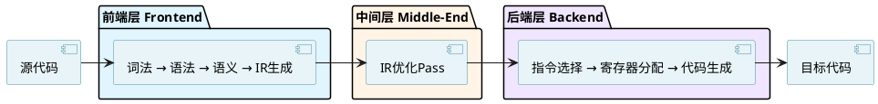
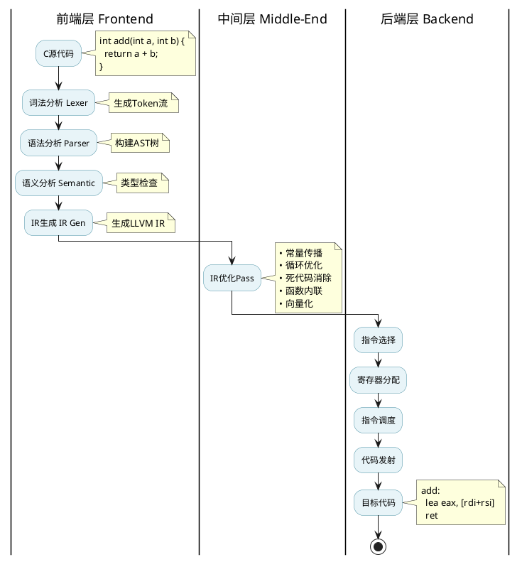

# C语言编译原理基础

## 概述

要理解C语言的内存安全问题，必须先理解C程序的编译过程。本章将介绍C语言编译的完整流程，包括编译器的三层架构设计以及从源代码到机器码的转换过程，为后续章节的学习打下基础。

## C语言编译流程与架构

### 编译器的三层架构

现代编译器（如LLVM）采用模块化的三层架构设计：



**架构优势：**

这种三层架构通过前后端分离实现了高度模块化：多种源语言（C、C++、Rust等）可以共享同一套优化层和后端，添加新语言或新目标平台时只需开发对应的前端或后端模块。这种设计将复杂度从 N×M（每种语言都要为每种目标平台单独实现）降低到 N+M（N个前端 + M个后端），极大提高了编译器的可扩展性和维护效率。

### 完整编译流程



### 前端阶段详解

前端负责理解源代码，将其转换为中间表示。

**1. 词法分析 (Lexical Analysis)**

将源代码文本分解为标记(Token)流，为语法分析提供结构化的输入。

```c
// 源代码
int sum = a + b;

// Token流
INT, IDENTIFIER("sum"), EQUAL, IDENTIFIER("a"), PLUS, IDENTIFIER("b"), SEMICOLON
```

**2. 语法分析 (Syntax Analysis)**

根据C语言语法规则构建抽象语法树(AST)，将Token序列转换为树状结构，表达代码的层次关系和执行顺序。

```c
// 源代码
int sum = a + b;

// AST结构
VarDecl: sum (type: int)
└─ BinaryOperator: '+'
   ├─ DeclRefExpr: 'a'
   └─ DeclRefExpr: 'b'
```

**3. 语义分析 (Semantic Analysis)**

执行类型检查、符号解析等语义验证，确保代码在语义层面的正确性（变量是否声明、类型是否匹配等）。

```c
int x = "hello";   // 错误：类型不兼容
undeclared_func(); // 错误：未声明的函数
```

**4. 中间代码生成 (IR Generation)**

将AST转换为平台无关的中间表示(如LLVM IR)，这种统一的表示形式便于后续进行跨平台的优化和代码生成。

```c
// C代码
int add(int a, int b) {
    return a + b;
}

// LLVM IR
define i32 @add(i32 %a, i32 %b) {
entry:
  %sum = add i32 %a, %b
  ret i32 %sum
}
```

### 中间层阶段详解

中间层基于IR进行各种优化，提升程序性能。优化器会执行多轮优化Pass，每个Pass专注于特定的优化策略：常量传播会在编译期计算出可确定的值，死代码消除会删除永不执行的代码分支，循环优化通过循环展开和循环不变量外提来提升循环性能，函数内联通过消除函数调用开销来加速执行，向量化则利用SIMD指令实现数据级并行计算。这些优化都在平台无关的IR层面进行，因此优化成果可以被所有目标平台共享。

### 后端阶段详解

后端将优化后的IR翻译为特定目标平台的机器码。这个过程首先进行指令选择，将平台无关的IR指令映射到目标机器的具体指令集（如x86-64、ARM等）。接着进行寄存器分配，为程序中的变量分配有限的物理寄存器，并在寄存器不足时生成内存读写指令。然后进行指令调度，重新排列指令执行顺序以充分利用CPU流水线和减少指令间的依赖等待。最后通过代码发射阶段生成最终的二进制机器码或汇编代码。

```asm
# x86-64汇编示例
add:
    lea eax, [rdi + rsi]  ; eax = a + b
    ret
```

## 从编译到内存

C编译器将源代码转换为高效的机器码，经过词法分析、语法分析、语义分析、IR优化和代码生成等多个阶段。然而，编译器在这些阶段主要关注语法正确性和基本类型检查，许多运行时的内存访问错误（如数组越界、空指针解引用）无法在编译期发现。

要理解为什么C语言会有这些内存安全问题，以及这些问题会带来什么后果，我们首先需要了解C程序在运行时的内存组织方式。下一章将详细介绍C语言的内存布局（栈、堆、数据段等）和内存分配机制，为分析内存安全问题打下基础。