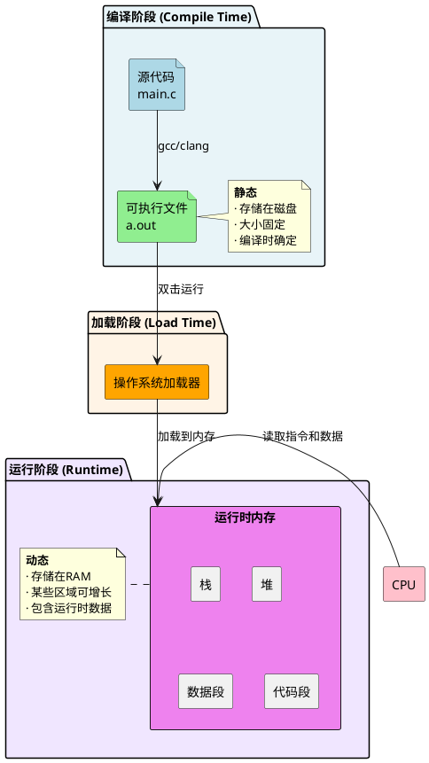
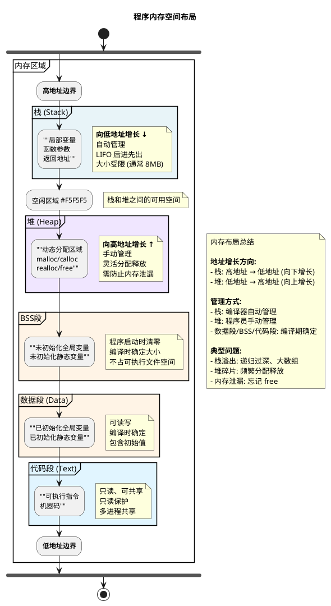
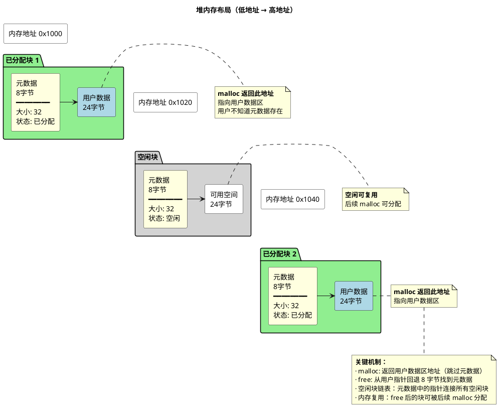

---
title: C语言内存基础
date: 2026-02-02
categories:
  - 安全语言
tags:
  - C语言
  - 内存管理
  - 程序运行时
  - 指针
---

# C语言内存基础

## 概述

第一章介绍了C程序从源代码到可执行文件的编译流程。当可执行文件运行时，操作系统会将它加载到内存中，但内存并非简单的连续空间——程序的不同数据会被分配到不同的内存区域，每个区域都有特定的用途和特性。

本章将揭示程序运行时的内存组织方式：栈、堆、数据段、BSS段、代码段各自存储什么数据，如何分配和管理，以及它们之间的区别。理解这些内存分区是学习C语言的基础，也是后续章节（语法特性、内存安全）的前置知识。

## 从源代码到运行：可执行文件与内存



C程序的生命周期包括三个阶段：编译阶段将源代码翻译成机器码并保存为可执行文件（存储在磁盘），加载阶段由操作系统将可执行文件加载到内存，运行阶段CPU从内存中读取指令和数据执行程序。可执行文件是静态的（大小固定、内容在编译时确定），而运行时内存是动态的（某些区域可增长、包含所有运行时数据）。理解这一区别后，我们来看程序运行时内存是如何组织的。

## 程序内存布局

当程序被加载到内存后，操作系统会为其分配一段连续的**虚拟地址空间**，并按照功能将这段空间划分为几个不同的区域。这些区域各司其职：有的存储可执行指令，有的存储全局数据，有的用于函数调用，有的用于动态分配。理解这些分区的特性和作用，是掌握C语言内存管理的基础。

### 典型内存分区



上图展示了程序运行时的完整内存布局。从地址空间分布来看，代码段位于最低的用户空间地址（紧接着内核保留区），往上依次是数据段、BSS段、堆区，最后是从高地址向下增长的栈。这种布局既有历史原因（早期内存设计的延续），也体现了设计智慧：静态内容（代码、全局数据）放在固定位置，动态内容（栈、堆）从两端相向增长，最大化利用中间的可用空间。

接下来我们将深入了解每个区域的工作机制和特性。

### 各内存区域详解

#### 栈与堆：动态内存的两种机制

栈（Stack）和堆（Heap）是程序运行时最活跃的两个动态内存区域。栈由编译器自动管理，遵循后进先出（LIFO）原则，用于局部变量和函数调用；堆由程序员手动管理，通过malloc/free操作，用于动态分配任意大小的数据。两者的根本区别在于：**栈追求速度和自动化，堆追求灵活性和控制权**。

**为什么栈向下增长、堆向上增长？**

```
高地址 0xFFFFFFFF
┌──────────────┐
│   栈 ↓       │  从高地址向低地址增长
│              │
│  未分配空间  │  弹性缓冲区
│              │
│   堆 ↑       │  从低地址向高地址增长
└──────────────┘
低地址 0x00000000
```

相向增长设计的核心目的：**最大化内存利用率**。栈和堆从内存两端出发，中间形成动态缓冲区，避免预先划定固定边界导致的空间浪费。栈向下增长符合多数处理器架构的硬件设计（如x86的ESP寄存器自然递减），堆向上增长则简化了内存分配器的实现。当两者相遇时，内存耗尽，操作系统触发错误。

#### 栈（Stack）详解

**1. 什么是栈？**

栈是用于函数调用的内存区域，从高地址向低地址增长。它由编译器自动管理，遵循**后进先出（LIFO）**原则：最后调用的函数最先返回。函数进入时自动分配空间，退出时自动释放，程序员无需干预。栈的大小有限（Linux默认8MB），这决定了它只适合存储小型、短生命周期的数据。

**2. 栈帧：函数调用的基本单位**

每次函数调用都会在栈上创建一个独立的**栈帧（Stack Frame）**，它包含该函数运行所需的全部信息：

```
单个栈帧的内部结构：
┌─────────────────┐ <- 栈帧起始（高地址）
│  函数参数       │    调用者传入的参数
├─────────────────┤
│  返回地址       │    函数结束后跳回的位置
├─────────────────┤
│  旧的帧指针     │    保存调用者的栈帧位置
├─────────────────┤
│  局部变量       │    函数内定义的变量
└─────────────────┘ <- 栈帧结束（低地址）
```

函数返回时，整个栈帧被销毁，所有局部变量同时释放。

**3. 栈的工作机制**

**栈与栈帧的关系：** 栈是整块内存空间，栈帧是其中的片段。多个函数调用会产生多个栈帧，它们按时间顺序堆叠：

```
多次函数调用的栈布局：
┌─────────────────┐ <- 栈底（高地址，固定）
│  main的栈帧     │    程序入口，最先调用
├─────────────────┤
│  func_a的栈帧   │    main调用func_a时创建
├─────────────────┤
│  func_b的栈帧   │    func_a调用func_b时创建（当前活跃）
└─────────────────┘ <- 栈顶（低地址，动态移动）
        ↓
     继续增长
```

**工作流程：** 调用函数时，在栈顶创建新栈帧；函数返回时，销毁该栈帧，栈顶回退。

**4. 完整示例**

```c
void main() {
    int x = 1;        // main的栈帧：存储x
    func_a();         // 调用func_a
}                     // 程序结束，销毁main的栈帧

void func_a() {
    int a = 2;        // func_a的栈帧：存储a
    func_b();         // 调用func_b，栈顶向下移动
}                     // func_b返回后，销毁func_a的栈帧

void func_b() {
    int b = 3;        // func_b的栈帧：存储b
    int c = 4;        // 同一栈帧内继续分配
}                     // 函数返回，销毁func_b的栈帧，栈顶回退
```

**执行过程：**
1. `main`调用时：创建栈帧，存储`x`
2. 调用`func_a`：在栈顶创建新栈帧，存储`a`
3. 调用`func_b`：继续在栈顶创建栈帧，存储`b`和`c`
4. `func_b`返回：销毁其栈帧，`b`和`c`消失
5. `func_a`返回：销毁其栈帧，`a`消失
6. 程序结束：销毁`main`的栈帧

**5. 栈的自动分配特性**

栈上的内存分配是**自动**的，无需程序员干预：

```c
void function() {
    int x = 10;           // 进入函数时自动分配
    char buffer[1024];    // 自动分配
    double values[100];   // 自动分配
    
    // 使用这些变量...
    
}  // 函数返回时，所有局部变量自动释放，栈指针回退
```

**自动分配的特点**：
- **速度极快**：仅需移动栈指针（一条CPU指令）
- **无需手动管理**：编译器自动处理分配和释放
- **空间有限**：受栈大小限制（通常8MB）
- **生命周期短**：仅在函数执行期间存在

**适用场景**：
- 小型、临时数据
- 函数调用期间使用的临时数组
- 编译时大小已知的数据结构

**不适用场景**：
- 大型数据（可能栈溢出）
- 需要跨函数传递的数据
- 编译时大小未知的数据

#### 堆（Heap）详解

**核心特性：**

堆用于动态内存分配，从低地址向高地址增长。与栈的自动管理不同，堆的生命周期完全由程序员控制——通过malloc/calloc/realloc分配内存，通过free释放内存，分配和释放的顺序可以任意。这种灵活性既是堆的优势（可以创建任意大小、任意生命周期的数据），也是风险所在（忘记释放会导致内存泄漏，过早释放会导致悬空指针）。

**示例：**
```c
void heap_example() {
    // 堆分配：从低地址向高地址增长
    int *ptr1 = (int*)malloc(sizeof(int));        // 第一次分配
    int *arr = (int*)malloc(100 * sizeof(int));   // 第二次分配，地址更高
    
    *ptr1 = 42;
    arr[0] = 100;
    
    free(ptr1);  // 可以按任意顺序释放
    free(arr);   // 顺序无关
}
```

**堆内存管理：**

堆采用链表或位图等数据结构管理内存块，每个内存块包含**元数据**（块大小、分配状态、链接指针等）和**用户数据**两部分。`malloc`返回的指针指向用户数据区而非元数据，当调用`free`时，分配器通过指针回退找到元数据，将该块标记为空闲以供后续复用。这种设计对用户透明，元数据由分配器自动维护。



**堆的工作原理：**
```c
int *p1 = (int*)malloc(4);   // 分配器在堆中找到4字节空间
int *p2 = (int*)malloc(8);   // 在p1后面（更高地址）分配8字节
free(p1);                     // 释放p1，留下空洞
int *p3 = (int*)malloc(4);   // 可能复用p1的空间（如果合适）
```

**两者的本质区别：**

| 特性 | 栈（Stack） | 堆（Heap） |
|------|------------|-----------|
| **管理方式** | 编译器自动管理 | 程序员手动管理 |
| **分配速度** | 极快（仅移动栈指针） | 较慢（需要查找合适的空闲块） |
| **释放方式** | 函数返回时自动释放 | 必须显式调用free |
| **数据结构** | 后进先出（LIFO） | 无特定顺序 |
| **碎片问题** | 无碎片 | 可能产生内存碎片 |
| **大小限制** | 有限（通常8MB） | 受系统总内存限制 |
| **生命周期** | 局限于函数作用域 | 由程序员控制 |
| **典型用途** | 局部变量、函数调用 | 大型数据、动态大小数据 |

#### 栈与堆的使用场景选择

**什么时候用栈？**
```c
void use_stack() {
    int small_array[100];     // 小型、固定大小 → 栈
    char buffer[256];         // 临时缓冲区 → 栈
    
    // 优点：速度快，自动管理
    // 限制：大小受限，生命周期短
}
```

**什么时候用堆？**
```c
void use_heap() {
    // 大型数据
    int *large_array = (int*)malloc(1000000 * sizeof(int));
    
    // 动态大小（编译时未知）
    int n;
    scanf("%d", &n);
    int *dynamic_array = (int*)malloc(n * sizeof(int));
    
    // 需要跨函数传递
    return_to_caller(dynamic_array);
    
    // 注意：必须记得释放
    free(large_array);
}
```

**堆的动态内存管理函数**

C语言提供了一组标准库函数用于堆内存的分配和释放：

**1. malloc() - 分配未初始化内存**

```c
void* malloc(size_t size);

// 示例：分配10个int的空间
int *ptr = (int*)malloc(sizeof(int) * 10);
if (ptr == NULL) {
    // 内存分配失败
    return -1;
}

// 使用内存
ptr[0] = 42;

// 释放内存
free(ptr);
```

> **注意**：`malloc`分配的内存**未初始化**，包含垃圾值。

**2. calloc() - 分配并清零内存**

```c
void* calloc(size_t num, size_t size);

// 示例：分配10个int并全部初始化为0
int *arr = (int*)calloc(10, sizeof(int));
if (arr == NULL) {
    return -1;
}

// arr[0] 到 arr[9] 都已是0
free(arr);
```

> **与malloc的区别**：`calloc`会将所有字节初始化为0。

**3. realloc() - 调整已分配内存大小**

```c
void* realloc(void *ptr, size_t new_size);

// 示例：扩展数组容量
int *arr = (int*)malloc(10 * sizeof(int));

// 扩展到20个元素
int *new_arr = (int*)realloc(arr, 20 * sizeof(int));
if (new_arr == NULL) {
    free(arr);  // 失败时释放原内存
    return -1;
}
arr = new_arr;  // 更新指针

free(arr);
```

> **注意**：`realloc`可能移动内存位置，必须使用返回值更新指针。

**4. free() - 释放内存**

```c
void free(void *ptr);

// 示例
int *ptr = (int*)malloc(sizeof(int));
*ptr = 42;
free(ptr);
```

**基本使用规则**：
- 总是检查返回值（可能失败返回NULL）
- 每个`malloc/calloc`都要对应一个`free`
- 只能释放堆上分配的内存

**缓冲区（Buffer）的概念**

在实际编程中，我们经常看到这样的代码：

```c
char buffer[1024];           // 栈上的数组
char *buf = malloc(1024);    // 堆上的数组
```

这些被称为**缓冲区（Buffer）**。缓冲区不是一种新的内存区域（它就是栈或堆上的数组），而是对数组**特定用途**的描述——用于**数据的临时中转**。

**缓冲区的典型用途**：

```c
// 场景1：文件读取
void read_file() {
    char buffer[1024];  // 临时存放文件内容
    FILE *fp = fopen("data.txt", "r");
    while (fgets(buffer, sizeof(buffer), fp) != NULL) {
        process_line(buffer);  // 数据流：文件 → buffer → 处理函数
    }
    fclose(fp);
}

// 场景2：网络通信
void handle_request() {
    char recv_buffer[4096];   // 接收数据的临时存储
    recv(socket, recv_buffer, sizeof(recv_buffer), 0);
    process_request(recv_buffer);
}

// 场景3：字符串格式化
void log_message(const char *username) {
    char buffer[256];  // 临时组装字符串
    sprintf(buffer, "User: %s", username);
    write_to_log(buffer);
}
```

**缓冲区的特征**：
1. **从数据源读取**（文件、网络、用户输入）
2. **临时存储在内存**
3. **传递给处理函数**
4. **内容会被覆盖或丢弃**

**对比：非缓冲区的数组**

```c
int scores[100];  // 这是数据存储，不是缓冲区
scores[0] = 95;   // 数据会保留并反复访问
```

> 💡 **为什么要特别关注缓冲区？** 
> 
> 因为缓冲区通常存储**来自外部的、大小不确定的数据**（用户输入、文件内容、网络包），而缓冲区本身是**预分配的固定大小**。当外部数据超过缓冲区大小时，就会发生**缓冲区溢出（Buffer Overflow）**——这是C语言最危险的安全漏洞之一。详细内容将在第四章深入讨论。

> 💡 **详细的内存安全问题和防御措施**将在第四章深入讨论。

#### 数据段（Data Segment）与 BSS段（Block Started by Symbol）

全局变量和静态变量根据**是否初始化以及初始化的值**，被分别存储在Data段或BSS段。这两个段的设计体现了编译器的优化策略。

**全局变量为什么不放在堆里?**

在了解Data段和BSS段之前，先理解为什么全局变量需要专门的内存区域：

全局变量有固定的生命周期（整个程序运行期），这是由C语言的作用域规则决定的：全局变量在程序启动时就存在，直到程序结束才销毁，不依赖于任何函数调用。这与堆的动态特性根本不匹配：
- 堆需要程序员手动malloc/free，而全局变量应该自动存在
- 堆地址在运行时才确定，而全局变量地址编译时就要固定（便于直接寻址）
- 堆有内存碎片和分配开销，而全局变量是连续分配、零成本访问
- Data段和BSS段在程序加载时由操作系统一次性设置好，无需运行时管理

**Data段 vs BSS段：核心区别**

| 特性 | **Data段** | **BSS段** |
|------|-----------|----------|
| **存储内容** | 已初始化为**非零值**的全局/静态变量 | 未初始化或初始化为**0**的全局/静态变量 |
| **可执行文件中** | 存储**实际的初始值** | 只存储**元数据**（变量名、大小） |
| **文件占用空间** | 完整大小（如4MB数组占4MB） | 极小（几十字节元数据） |
| **加载到内存时** | 操作系统**复制**初始值到内存 | 操作系统**分配空间并清零** |
| **内存占用** | 完整大小 | 完整大小 |
| **运行时权限** | 可读可写 | 可读可写 |

**为什么需要BSS段？**

BSS段是一种编译优化策略：Data段必须在文件中存储实际初始值，而全零数组会导致可执行文件膨胀。BSS段通过只存储元数据（变量名和大小），程序加载时由操作系统清零，大幅减小文件体积。

**示例对比：**

```c
int arr1[1000000] = {0};  // Data段：可执行文件 ~4MB
int arr2[1000000];        // BSS段：可执行文件 ~15KB（C标准保证为0）
```

**变量分类规则：**

```c
// Data段：已初始化为非零值
int global_data = 100;
static int static_data = 200;

// BSS段：未初始化或初始化为0
int global_bss;
int zero_global = 0;

// 栈：局部变量（不自动清零！）
void func() {
    int local = 10;
}

// 堆：动态分配（不自动清零！）
int *ptr = malloc(sizeof(int) * 100);
```

**关键区别总结：**

| 变量类型 | 存储位置 | 初始化行为 | 生命周期 |
|---------|---------|-----------|----------|
| 全局/静态变量（非零初始化） | Data段 | 可执行文件存储实际值 | 整个程序 |
| 全局/静态变量（零/未初始化） | BSS段 | 程序加载OS清零 | 整个程序 |
| 局部变量 | 栈 | **⚠️ 不自动清零**（垃圾值） | 函数调用期间 |
| malloc分配 | 堆 | **⚠️ 不自动清零**（垃圾值） | 手动管理 |

#### 代码段（Text Segment）

代码段存储编译后的**机器指令**（机器码），与数据段/BSS段存储变量数据的性质完全不同。

**核心特性：**
- **只读保护**：防止程序意外修改自身代码（写入代码段会触发段错误）
- **进程间共享**：多个进程可共享同一份代码（如动态链接库），节省内存
- **编译时确定**：大小和内容在编译时固定

**示例：**
```c
int add(int a, int b) {
    return a + b;
}

static int helper(int x) {
    return x * 2;
}
// 所有函数的机器码都存储在代码段
// static仅限制链接作用域，不改变存储位置
```

**代码段 vs 数据段的区别：**

| 特性 | **代码段（Text）** | **Data/BSS段** |
|------|------------------|---------------|
| **存储内容** | 机器指令 | 变量数据 |
| **权限** | 只读（防止修改代码） | 可读可写 |
| **进程间共享** | 可共享（节省内存） | 不共享（每个进程独立数据） |
| **典型大小** | 取决于代码复杂度 | 取决于全局变量数量 |

---

**小结：程序内存布局回顾**

至此，我们完整地了解了程序运行时内存的五大区域：

| 内存区域 | 存储内容 | 管理方式 | 生命周期 | 典型用途 |
|---------|---------|---------|---------|---------|
| **栈** | 局部变量、函数参数 | 编译器自动 | 函数作用域 | 临时数据、函数调用 |
| **堆** | 动态分配数据 | 程序员手动 | malloc到free | 大型/动态数据 |
| **Data段** | 已初始化全局/静态变量 | 编译时确定 | 整个程序 | 非零初始值 |
| **BSS段** | 未初始化或零初始化全局/静态变量 | 编译时确定 | 整个程序 | 零初始值优化 |
| **代码段** | 机器指令 | 编译时确定 | 整个程序 | 函数代码 |
