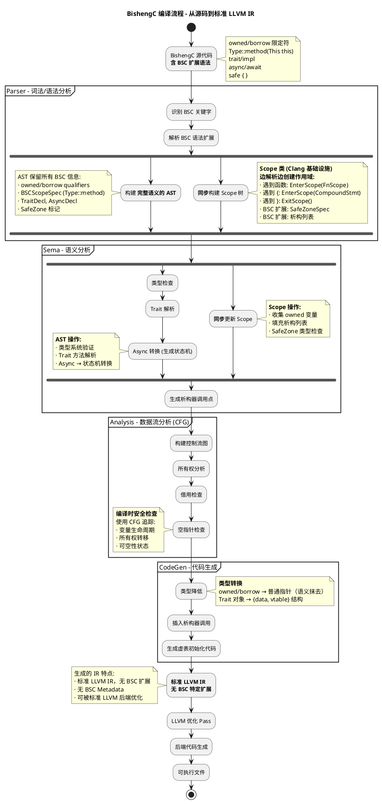

# BishengC完整架构与核心机制

## 概述

第四章中我们深入分析了C语言的六大内存安全问题：空间安全、时间安全、初始化安全、空指针解引用、类型安全和并发安全。BishengC是一个基于Clang的C语言安全扩展，通过在编译器前端添加所有权系统和静态分析，针对性地解决了**部分**内存安全问题。

### 已实现的安全机制

以下针对第四章提出的六大安全问题及其子问题，逐一分析BishengC的实现情况：

#### 一、时间安全问题（Temporal Safety）

| 子问题 | 测试代码 | Safe区域检测 | 编译错误信息 | 实现方式 |
|-------|---------|------------|------------|---------|
| **Use-After-Free** | `int owned* p = malloc(...);`<br>`free(p); *p = 100;` | ✅ **完全阻止** | `unsafe function call is forbidden`<br>`'*' operator is forbidden` | Safe区域不允许调用`malloc/free`<br>Safe区域不允许使用`*`解引用操作符 |
| **Double-Free** | `int owned* p = malloc(...);`<br>`free(p); free(p);` | ✅ **完全阻止** | `unsafe function call is forbidden` | Safe区域不允许调用`free`函数 |
| **内存泄漏** | `int owned* p = malloc(...);`<br>`*p = 42; // 忘记free` | ✅ **完全阻止** | `unsafe function call is forbidden` | Safe区域不允许调用`malloc/calloc/realloc` |
| **悬空指针（栈）** | `int local = 42;`<br>`return &local;` | ✅ **完全阻止** | `'&' operator is forbidden` | Safe区域不允许使用`&`取地址操作符 |

**实现机制总结：**

Safe区域通过**编译时禁止危险操作**，从根源消除时间安全问题：
- 不允许调用内存管理函数（`malloc/free/realloc/calloc`）
- 不允许使用指针操作符（`*`解引用、`&`取地址、`->`成员访问）
- 不允许`void*`与其他指针类型之间的转换
- 强制`borrow`类型变量在声明时初始化

**设计哲学：** 默认安全 - Safe区域功能受限但100%安全，需要底层操作时显式使用`unsafe`块

#### 二、空指针解引用问题（NULL Pointer Dereference）- 未实现

**实测结论（BishengC 15.0.4）：NULL指针检测功能基本不工作**

<table>
<thead>
  <tr>
    <th>测试场景</th>
    <th>测试代码</th>
    <th>编译结果</th>
    <th>检测能力</th>
  </tr>
</thead>
<tbody>
  <tr>
    <td><strong>测试1：静态NULL解引用</strong></td>
    <td><code>int* _Nullable p = NULL;<br>*p = 42;</code></td>
    <td rowspan="5">✅ <strong>编译通过</strong><br>（5/5）</td>
    <td>❌ <strong>未检测</strong><br><small>应该失败但通过</small></td>
  </tr>
  <tr>
    <td><strong>测试2：函数返回NULL</strong></td>
    <td><code>may_return_null() 返回 NULL<br>后解引用 *p = 42;</code></td>
    <td>❌ <strong>未检测</strong><br><small>应该失败但通过</small></td>
  </tr>
  <tr>
    <td><strong>测试3：NULL赋值后解引用</strong></td>
    <td><code>p = NULL;<br>*p = 42;</code></td>
    <td>❌ <strong>未检测</strong><br><small>应该失败但通过</small></td>
  </tr>
  <tr>
    <td><strong>测试4：条件检查后解引用</strong></td>
    <td><code>if (p != NULL) {<br>&nbsp;&nbsp;*p = 42;<br>}</code></td>
    <td>⚠️ <strong>预期行为</strong><br><small>正确通过</small></td>
  </tr>
  <tr>
    <td><strong>测试5：未标注函数返回NULL</strong></td>
    <td><code>无 _Nullable 注解<br>编译通过正常</code></td>
    <td>⚠️ <strong>符合预期</strong><br><small>无标注</small></td>
  </tr>
  <tr style="background-color: #fff3cd; font-weight: bold;">
    <td>📊 <strong>总结</strong></td>
    <td colspan="2"><code>_Nullable</code> 注解仅语法支持，无编译时检查</td>
    <td style="color: #dc3545;">❌ <strong>0/5 检测成功</strong></td>
  </tr>
</tbody>
</table>

**详细测试代码：**

**测试1：静态NULL解引用**
```c
int* _Nullable p = NULL;
*p = 42;  // ❌ 预期：编译错误  ✅ 实际：编译通过
```

**测试2：函数返回NULL**
```c
int* _Nullable may_return_null() {
    return NULL;
}
int* _Nullable p = may_return_null();
*p = 42;  // ❌ 预期：编译错误  ✅ 实际：编译通过
```

**测试3：NULL赋值后解引用**
```c
int* _Nullable p = &x;
p = NULL;
*p = 42;  // ❌ 预期：编译错误  ✅ 实际：编译通过
```

**测试4：条件检查后解引用**
```c
int* _Nullable p = NULL;
if (p != NULL) { 
    *p = 42;  // ✅ 预期：编译通过  ✅ 实际：编译通过
}
```

**测试5：未标注函数返回NULL**
```c
int* no_annotation() { 
    return NULL; 
}
int* p = no_annotation();
*p = 42;  // ⚠️ 无标注，编译通过符合预期
```

**完整测试函数：**
```c
// 测试1：静态NULL - 应该报错但编译通过
void test1_static_null(void) {
    int* _Nullable p = NULL;
    *p = 42;  // ❌ 预期：编译错误  ✅ 实际：编译通过
}

// 测试3：函数返回NULL - 应该报错但编译通过
int* _Nullable may_return_null(void) {
    return NULL;
}

void test3(void) {
    int* _Nullable p = may_return_null();
    *p = 42;  // ❌ 预期：编译错误  ✅ 实际：编译通过
}

// 测试5：NULL赋值 - 应该报错但编译通过
void test5(void) {
    int x = 100;
    int* _Nullable p = &x;
    p = NULL;
    *p = 42;  // ❌ 预期：编译错误  ✅ 实际：编译通过
}
```

**实现现状：**
- ✅ `_Nullable`/`_Nonnull`注解语法支持（编译器接受但不报错）
- ❌ 无静态数据流分析
- ❌ 无CFG路径可空性追踪
- ❌ 无编译时NULL检查

**源码位置：** `clang/lib/Analysis/BSC/BSCNullabilityCheck.cpp` 存在，但功能未启用或实现不完整

**结论：** BishengC当前版本的NULL指针检测功能**基本未实现**，`_Nullable`注解仅作为类型标注存在，不产生任何编译时检查

#### 三、初始化安全问题（Initialization Safety）- 静态分析支持

| 子问题 | BishengC实现情况 | 检测能力 | 局限性 |
|-------|----------------|---------|--------|
| **未初始化变量读取** | ⚠️ **静态分析检测** | 扩展Clang现有的uninitialized检查<br>CFG追踪定义-使用链 | ❌ 复杂控制流可能漏检<br>❌ 条件初始化难以追踪 |
| **条件分支初始化** | ⚠️ **部分检测** | 示例：`if (cond) { x = 1; } use(x);` | ❌ 多分支交汇时精度下降 |

**实现方式**：基于Clang现有的`-Wuninitialized`警告机制增强

**局限性**：
- 仅静态分析，编译时警告不强制
- 不像Rust强制所有路径都初始化
- 复杂场景下保守分析（可能误报或漏报）

#### 四、空间安全问题（Spatial Safety）- 基本未实现

| 子问题 | BishengC实现情况 | 当前能力 | 原因 |
|-------|----------------|---------|------|
| **数组越界** | ❌ **仅常量索引编译警告** | `arr[5]`（数组大小3）→ 编译警告<br>`arr[runtime_i]` → 无检查 | 需运行时插桩或胖指针<br>会破坏标准LLVM IR兼容性 |
| **缓冲区溢出** | ❌ **不支持** | 写入超过分配大小无检查 | 需IR携带长度元数据<br>BishengC选择标准IR |
| **指针越界访问** | ❌ **不支持** | 指针运算越界无检查 | 需运行时元数据追踪<br>类似ASan机制 |

**为什么不实现**？
- **架构选择**：BishengC生成标准LLVM IR，CodeGen后语义丢失
- **性能代价**：运行时边界检查开销20-50%
- **兼容性**：胖指针会破坏ABI，影响C互操作

**替代方案**：
- 提供库级安全抽象（如`Slice<T>`），但非强制使用
- 依赖程序员手动使用安全API

#### 五、类型安全问题（Type Safety）- Safe区域严格限制

BishengC通过**safe/unsafe区域分层**实现部分类型安全：

| 类型操作 | Safe区域 | Unsafe区域 | 实现位置 |
|---------|---------|-----------|---------|
| **裸指针使用** | ❌ 禁止 | ✅ 允许 | `SemaBSCSafeZone.cpp` |
| **union类型** | ❌ 禁止 | ✅ 允许 | 同上 |
| **精度丢失转换** (`int`→`char`) | ❌ 禁止 | ✅ 允许 | 同上 |
| **指针与非指针互转** | ❌ 禁止 | ✅ 允许 | 同上 |
| **强制类型转换** | ⚠️ 限制 | ✅ 允许 | 同上 |
| **安全转换** (`char`→`int`) | ✅ 允许 | ✅ 允许 | - |
| **`owned*`→`void* owned`** | ✅ 允许 | ✅ 允许 | - |

**实现机制**：
- 编译时在Sema阶段检查Safe区域的类型操作
- Unsafe区域程序员承担责任
- 不涉及运行时检查

**局限性**：
- ❌ 无法防止类型混淆漏洞（需运行时类型信息）
- ❌ 无泛型约束验证（trait bounds）
- ❌ 无类型状态转换检查（typestate）

#### 六、并发安全问题（Concurrency Safety）- 完全未实现

| 子问题 | BishengC实现情况 | 原因 |
|-------|----------------|------|
| **数据竞争检测** | ❌ **不支持** | 所有权系统仅考虑单线程<br>无`Send`/`Sync` trait机制 |
| **线程安全类型保证** | ❌ **不支持** | 无类型系统区分线程安全性 |
| **原子操作内存序** | ❌ **不支持** | 依赖C11标准`_Atomic`，无编译器检查 |

**源码证据**：
```bash
# 搜索并发相关代码
grep -r "Send\|Sync\|thread" clang/lib/Sema/BSC/ clang/lib/Analysis/BSC/
# 结果：无相关实现
```

**为什么不实现**？
- 需要类型系统扩展（引入trait机制）
- 需要借用检查器识别跨线程别名
- 可能需要MIR级IR承载并发语义
- 工程量巨大，且BishengC专注于单线程内存安全

### 尚未完全实现的功能

**1. 空间安全问题（运行时检查未实现）**
- **缓冲区溢出**：BishengC目前无法自动检测和拦截
- **数组越界**：仅有编译时常量索引警告，运行时无法保证（safe/unsafe块都不行）
- **指针越界访问**：无运行时元数据追踪，无法检测

**2. Use-After-Free运行时检测（未实现）**
- 虽然所有权系统在编译时阻止UAF，但**无运行时验证**
- 如果通过`unsafe`块绕过检查，运行时仍可能发生UAF
- 不同于ASan等运行时工具（BishengC无shadow memory机制）

**3. 类型安全（Safe区域严格限制）**

BishengC通过`safe`/`unsafe`区域实现**分层的类型安全保障**（实现位置：`SemaBSCSafeZone.cpp`）：

| 类型操作 | Safe区域 | Unsafe区域 |
|---------|---------|-----------|
| 裸指针（非`owned`/`borrow`） | 禁止 | 允许 |
| `union`类型 | 禁止 | 允许 |
| 精度丢失转换（`int`→`char`） | 禁止 | 允许 |
| 指针与非指针互转 | 禁止 | 允许 |
| 安全转换（`char`→`int`） | 允许 | 允许 |
| `owned*`→`void* owned` | 允许 | 允许 |

> **总结**：类型安全采用**区域分层策略**——`safe`区域编译器强制检查，`unsafe`区域程序员承担责任。

**3. 并发安全（完全未实现）**

源码分析确认：BishengC **没有任何并发安全机制**，所有权系统仅保证单线程内的内存安全，不考虑多线程场景。完全依赖程序员使用传统同步机制（如`pthread_mutex`、`atomic`等）。

---

## 整体架构设计

BishengC选择在**Clang前端**实现所有安全机制，不修改LLVM IR或后端，保持工具链兼容性。架构围绕三个核心问题展开：

1. **如何扩展类型系统**？→ 在Clang AST中添加`owned`/`borrow`/`nullable`等安全属性
2. **如何实现静态检查**？→ 在Sema阶段添加所有权分析、借用检查、空指针数据流分析
3. **如何保持兼容性**？→ 通过`safe`/`unsafe`区域隔离，允许渐进式迁移

### 编译流程概览

BishengC在编译器前端添加所有权系统和静态分析，完整的编译流程如下：



**关键阶段说明：**

- **Parser/Sema/Analysis**：完整保留安全语义（owned/borrow等），用于编译时检查
- **CodeGen**：安全语义降级为标准C/LLVM构造，owned/borrow限定符被抹去
- **LLVM IR**：完全是标准IR，无BishengC特定信息

**时间线：**
```
源代码 → Parser → Sema → Analysis → CodeGen → LLVM IR
        ↑________________↑___________↑
        语义保留，用于编译时检查      ↓
                                    语义丢失，转为标准 IR
```

---

