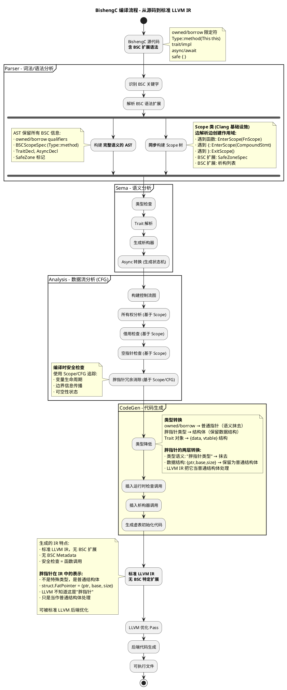
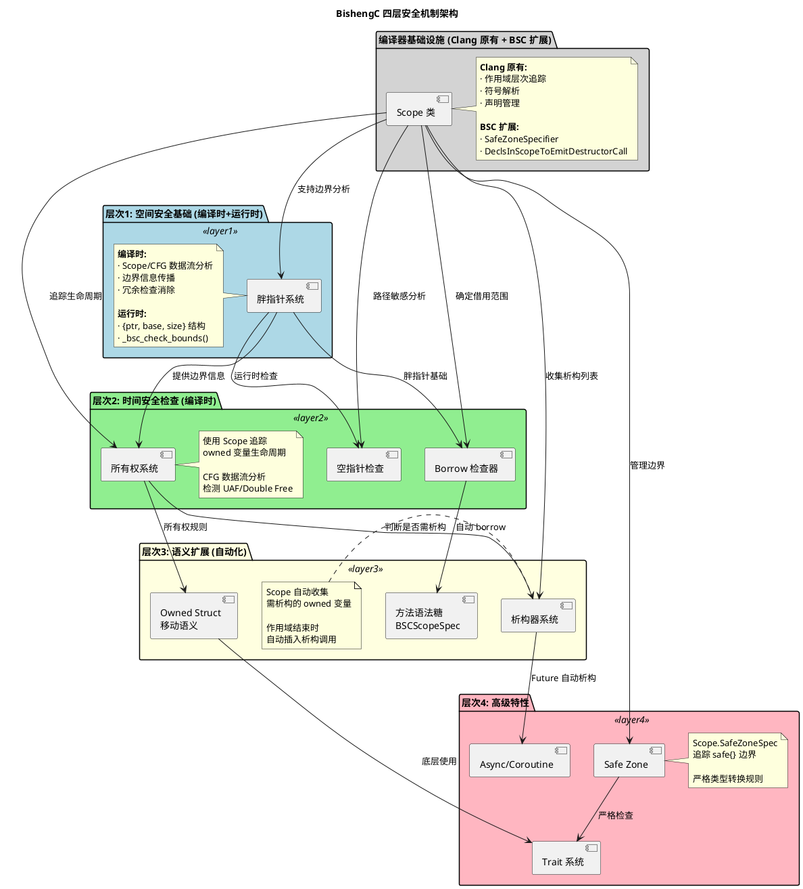

# BishengC完整架构与核心机制

## 概述

第三章中我们深入分析了 C 语言面临的各类内存安全问题：缓冲区溢出、Use After Free、Double Free、内存泄漏、空指针解引用等。这些问题的根本原因在于 C 语言缺乏：
- **空间安全保障**：指针不携带边界信息
- **时间安全保障**：无法追踪内存的生命周期
- **所有权语义**：不清楚谁负责释放内存

为了从根本上解决这些问题，BishengC 在 **Clang/LLVM 编译器基础设施**之上进行了深度改造，构建了一套完整的内存安全编译系统。本章将基于 BishengC 的源代码，详细剖析其架构设计和核心实现机制。


## 1. 架构概览

BishengC 是一个构建在 Clang 之上的**内存安全的 C 语言扩展**，通过编译器和运行时的协同工作，提供了多层次的内存安全保证。

BishengC 选择在 **Clang 前端**进行**所有安全机制**的实现，而不修改 LLVM IR 或后端。

**BishengC 的安全检查分为两类：**

1. **编译时检查**（静态可确定）
   - 所有权规则检查（owned 变量必须释放或转移）
   - 借用生命周期检查（borrow 不能超过所有者）
   - 类型安全检查（safe zone 的类型转换）
   - 空指针检查（部分可通过路径敏感分析确定）

2. **运行时检查**（动态才能确定）
   - **边界检查**：数组索引可能是运行时计算的变量 `p[i]`，编译时无法知道 `i` 的值
   - **空指针检查**：部分指针在复杂控制流中无法静态确定是否为空
   - **UAF 版本检查**：free 的时机可能依赖运行时条件

**BishengC 的运行时检查难以被 LLVM 后端优化**

**重要澄清：什么是"运行时检查"？**

BishengC 源代码本身**不包含**显式的运行时检查代码，程序员只写安全的类型标注：
```c
// BishengC 源代码 - 程序员只写这些
int *p = malloc(100);  // 编译器知道这是胖指针
p[i] = 42;             // 没有显式的检查代码
```

**编译器自动插入检查：**
```c
// CodeGen 阶段，编译器自动生成：
int *p = _bsc_create_fatptr(malloc(100), 100);  // 创建胖指针
_bsc_check_bounds(p, i);                         // 自动插入检查！
p[i] = 42;
```

**与 C 语言的对比：**

| 方面 | 传统 C | BishengC |
|-----|--------|---------|
| **检查代码** | 程序员手动写（可选） | 编译器自动插入（强制） |
| **示例** | `if (i >= size) abort();`<br>`p[i] = 42;` | `p[i] = 42;`<br>编译器自动插入检查 |
| **遗漏风险** | 高（容易忘记） | 无（编译器保证） |
| **代码量** | 需要显式写检查 | 源码简洁，编译器处理 |
| **运行时库** | 无专门库 | `_bsc_check_bounds()` 等函数 |

**三个阶段的区别：**

1. **BishengC 源代码**：干净，无显式检查
   ```c
   int *owned p = malloc(100);
   p[10] = 42;
   ```

2. **Clang CodeGen 生成的 LLVM IR**：包含自动插入的检查调用
   ```llvm
   %p = call %FatPointer @_bsc_create_fatptr(...)
   call void @_bsc_check_bounds(%p, 10)  ; 编译器自动插入
   ; 实际访问...
   ```

3. **运行时库**：提供检查函数的实现
   ```c
   // 运行时库代码（BishengC 提供）
   void _bsc_check_bounds(FatPointer *p, size_t offset) {
       if (offset >= p->size) {
           fprintf(stderr, "Bounds check failed!\n");
           abort();
       }
   }
   ```

**BishengC 在 Clang 前端的工作流程：**

1. **Parser/Sema/Analysis 阶段**：完整保留安全语义
   - owned/borrow qualifiers（所有权限定符）
   - 胖指针类型（带边界信息的特殊类型）
   - Trait 对象、async 函数等高层抽象
   - 基于这些语义进行编译时检查

2. **CodeGen 阶段**：**安全语义降级为标准 C/LLVM 构造**
   - `int *owned p` → 普通指针（owned 限定符被抹去）
   - `int *borrow p` → 普通指针（borrow 限定符被抹去）
   - 胖指针类型 → 普通结构体 `struct FatPointer {ptr, base, size}`
   - 边界检查 → 插入普通函数调用 `_bsc_check_bounds(ptr, base, size, offset)`
   - Trait 虚函数调用 → 普通的函数指针调用

3. **LLVM IR**：完全是标准 IR，无 BishengC 特定信息
   - 看不到 owned/borrow 语义（已抹去）
   - 看不到"这是胖指针"（只是普通结构体）
   - 看不到"这是安全检查"（只是普通函数调用）

**因此 LLVM 后端无法优化：**
- **无法识别冗余检查**：不知道 `_bsc_check_bounds()` 是边界检查，无法分析两次调用是否冗余
- **无法内联优化**：函数调用开销无法消除（除非强制 inline，但会增加代码体积）
- **无法基于安全语义优化**：例如无法利用"owned 指针独占"的信息做别名分析

**替代方案及其代价：**
- 如果在 LLVM IR 层实现（添加特殊指令或 metadata 标记安全信息）
  - ✅ 后端可以感知安全语义并优化
  - ❌ 需要修改 LLVM 核心，维护成本高
  - ❌ 与 LLVM 主线耦合，版本升级困难

BishengC 选择了"前端实现，后端标准化"的方案，接受运行时检查开销，换取工程上的可维护性。

**时间线说明：**
```
源代码 → Parser → Sema → Analysis → CodeGen → LLVM IR
        ↑________________↑___________↑
        语义保留，用于编译时检查      ↓
                                    语义丢失，转为标准 IR
```

**设计权衡：** 在编译时充分利用高层语义做检查（准确性高），接受运行时保留部分检查的代价（性能开销）。

| 优势 ✅ | 代价 ⚠️ |
|--------|---------|
| **编译前期保留语义用于分析**<br>在 Parser/Sema/Analysis 阶段，owned/borrow 等语义信息完整保留，用于编译时检查 | **编译后期语义被抹去**<br>CodeGen 生成 LLVM IR 时，高层语义转换成标准 IR（函数调用、结构体），无法被 LLVM 后端感知 |
| **精确的源码级分析**<br>基于 AST/CFG 的数据流分析，可追踪变量生命周期、所有权转移 | **LLVM Pass 无法优化安全检查**<br>后端看到的只是普通函数调用（如 `_bsc_check_bounds()`），无法知道这是边界检查并优化 |
| **编译时检查更准确**<br>类型系统、所有权规则在有完整语义信息的阶段检查，错误更早发现 | **运行时检查无法消除**<br>部分检查（如动态数组访问）必须保留到运行时，有性能开销 |
| **不影响 LLVM 生态**<br>生成标准 IR，可被现有 LLVM 优化 Pass 处理，兼容性好 | |
| **维护成本低**<br>与 LLVM 主线解耦，LLVM 版本升级不影响 BishengC 安全机制 | |

### 1.1 编译流程图



### 1.3 语法糖 (Desugaring) 设计



---

## 1.3 语法糖 (Desugaring) 设计

### 1.3.1 什么是语法糖？

在深入每个具体机制之前，我们先理解 BishengC 的整体设计思路：**通过四个层次的安全机制，层层递进地解决内存安全问题**。

### 2.1 层次1：空间安全基础 - 胖指针系统

**核心思想：编译时分析 + 运行时检查，让指针知道自己的边界**

传统 C 指针只有地址，不知道指向的内存有多大：
```c
int arr[10];
int *p = arr;
p[100] = 42;  // 越界！但无人知晓
```

胖指针通过携带 `{指针, 基地址, 大小}` 三元组，在运行时可以检查：
```c
// 胖指针内部：{ptr=arr+0, base=arr, size=40}
p[100];  // 运行时检查：100*4 >= 40？报错！
```

**提供的安全能力：**
- **编译时**：基于 Scope/CFG 的数据流分析，消除冗余边界检查
- **运行时**：空间安全检查，防止缓冲区溢出、数组越界
- 是其他所有机制的基础设施

### 2.2 层次2：安全检查 - 所有权、借用、空指针

**核心思想：在编译时就知道内存的生命周期和使用规则**

这一层建立在胖指针之上，通过类型系统增加三种编译时检查：

**2.2.1 所有权系统 (Ownership)**

解决"谁负责释放内存"的问题：
```c
int *owned p = malloc(100);    // p 拥有这块内存
int *owned q = p;              // 错误！所有权转移，p 失效
free(q);                       // 只有所有者能释放
```

**提供的安全能力：**
- 时间安全：防止 Use After Free、Double Free
- 内存泄漏检测（owned 变量必须被释放或转移）

**2.2.2 借用检查器 (Borrow Checker)**

解决"借用的内存不能比所有者活得更久"：
```c
int *owned owner = malloc(100);
int *borrow ref = owner;       // 借用，不能释放
free(owner);                   // 所有者释放
*ref = 42;                     // 错误！借用的对象已失效
```

**提供的安全能力：**
- 引用安全：确保借用不超过所有者生命周期
- 防止悬垂指针

**2.2.3 空指针检查 (Nullability Check)**

解决"指针是否可能为空"：
```c
int *p = get_value();          // 可能返回 NULL
if (p != NULL) {
    *p = 42;                   // 安全：编译器知道 p 非空
} else {
    *p = 42;                   // 错误！编译器知道 p 为空
}
```

**提供的安全能力：**
- 空指针安全：编译时追踪指针的可空性
- 路径敏感分析：不同分支中指针状态不同

**第2层的协同工作：**
这三个机制共同保证：
1. 胖指针有边界（层次1）
2. 知道谁拥有这块内存（所有权）
3. 借用不会超过所有者（借用检查）
4. 使用前确保非空（空指针检查）

### 2.3 层次3：语义扩展 - Scope、Owned Struct、析构器

**核心思想：自动应用层次2的安全规则，让程序员更轻松**

这一层不是新的安全机制，而是**语法糖 + 自动化**，让程序员不用手动标注那么多 owned/borrow。

**2.3.1 Scope 相关机制**

这里涉及两个不同但相关的概念：

**A. BSCScopeSpec - 语法糖 (用户层)**

提供类似 C++/Rust 的方法调用语法，自动应用 borrow：
```c
// 用户写
void Point::move(This this, int dx, int dy) {
    this.x += dx;  // 自动是 borrow，不能 free(this)
}

Point p = {0, 0};
p.move(5, 10);     // 自动转换为 Point_move(&p, 5, 10)
```

**提供的便利：**
- 语法更清晰（面向对象风格）
- 自动 borrow（防止在方法内释放对象）
- 依赖层次2的 borrow 检查器

**B. Scope 类 - 作用域追踪 (编译器内部)**

编译器内部的数据结构，用于在 Sema 阶段追踪作用域信息：
```cpp
// clang/include/clang/Sema/Scope.h
class Scope {
  unsigned Flags;                // 作用域类型标志 (函数/循环/类等)
  Scope *AnyParent;              // 父作用域
  DeclSetTy DeclsInScope;        // 作用域中的声明
  DeclContext *Entity;           // 关联的声明上下文
  
  #if ENABLE_BSC
  SafeZoneSpecifier SafeZoneSpec;  // Safe Zone 标记
  std::stack<VarDecl *> DeclsInScopeToEmitDestructorCall;  // 需要析构的变量
  #endif
};
```

**BishengC 对 Scope 类的扩展：**
- 追踪 Safe Zone 的开始/结束
- 收集需要调用析构器的 owned 变量
- 在作用域结束时自动插入析构调用

**2.3.2 Owned Struct（移动语义）**

让结构体作为整体管理所有权：
```c
owned struct Buffer {
    int *owned data;
    size_t len;
};

Buffer b1 = create_buffer();
Buffer b2 = b1;  // 移动所有权，b1 失效（不是拷贝！）
```

**提供的便利：**
- RAII 风格资源管理
- 防止部分移动（必须整体转移）
- 依赖层次2的所有权系统

**2.3.3 析构器系统**

自动生成清理代码：
```c
owned struct Resource {
    int *owned data;
    FILE *owned file;
}

// 编译器自动生成析构器
void Resource_destructor(owned Resource this) {
    free(this.data);   // 自动释放 owned 字段
    fclose(this.file);
}

{
    Resource r = create_resource();
    // ...
}  // 离开作用域，自动调用析构器
```

**提供的便利：**
- 自动资源释放（类似 C++ 析构函数）
- 防止忘记清理
- 依赖层次2的所有权系统判断哪些需要释放

**第3层与第2层的关系：**
- 第2层：定义规则（owned 能释放，borrow 不能释放）
- 第3层：自动应用规则（Scope 自动 borrow，析构器自动释放）

### 2.4 层次4：高级特性 - Safe Zone、Trait、Async

**核心思想：在前三层基础上，提供更高级的编程能力**

这一层提供可选的高级功能，每个都依赖前面的所有层次。

**2.4.1 Safe Zone（安全区域）**

在特定代码块内启用更严格的检查：
```c
safe {
    int x = 100;
    unsigned int y = x;  // 错误！safe 模式禁止有符号到无符号转换
    void (*f)() = unsafe_func;  // 错误！函数指针必须标记为 safe
}
```

**提供的能力：**
- 更严格的类型转换规则
- 防止隐式的不安全操作
- 依赖前面所有层次的检查

**2.4.2 Trait 系统**

类似 Rust 的接口抽象，支持多态：
```c
trait Drawable {
    void draw(This *this);
}

impl Drawable for Circle {
    void draw(This *this) { /* ... */ }
}

Drawable *obj = get_drawable();  // 胖指针 + 虚表
obj->draw(obj);                  // 通过虚表调用
```

**提供的能力：**
- 接口抽象和多态
- 底层仍是 borrow 胖指针
- 依赖层次1-3的所有安全保证

**2.4.3 Async/Coroutine**

异步编程支持：
```c
async int fetch_data(int id) {
    int result = await network_call(id);
    return result;
}

Future *f = fetch_data(42);  // 返回 Future 对象
int value = f->poll(f);       // 轮询结果
```

**提供的能力：**
- 协程和异步编程
- Future 对象是 owned struct（自动析构）
- 依赖层次3的 owned struct 和析构器

**第4层与前三层的关系：**
- 层次1-3 提供基础安全保证
- 层次4 在此基础上提供高级编程模型
- 每个高级特性都复用底层的安全机制

### 2.5 四层协同工作示例

让我们看一个完整例子，展示四层如何协同：

```c
// 层次4：Trait + Async
trait DataSource {
    async Buffer fetch(This *this, int id);
}

// 层次3：Owned Struct + 析构器
owned struct Buffer {
    char *owned data;  // 层次2：所有权
    size_t len;
};

// 层次3：Scope 方法
async Buffer DataSource::fetch(This this, int id) {
    // this 自动是 borrow (层次3)
    // 不能 free(this) (层次2的 borrow 检查)
    
    safe {  // 层次4：安全区域
        Buffer buf;
        buf.data = checked_malloc(1024);  // 层次1：胖指针
        buf.len = 1024;
        
        // 读取数据...
        
        return buf;  // 层次3：移动语义，所有权转移
    }
}  // 自动析构 (层次3)

int main() {
    DataSource *source = get_source();
    Future *f = source->fetch(source, 42);  // 层次4：async
    Buffer result = f->poll(f);              // 获取结果
    
    // 使用 result.data (层次1：边界检查)
    
    return 0;
}  // result 自动析构 (层次3)
```

**这个例子展示了：**
1. **层次1**：所有指针都是胖指针（编译时优化+运行时边界检查）
2. **层次2**：owned/borrow 明确所有权（编译时检查生命周期）
3. **层次3**：方法自动 borrow、Owned Struct 移动语义、自动析构
4. **层次4**：Trait 接口、Async 异步、Safe Zone 严格检查

**层层递进的设计哲学：**
```
层次4 (高级特性)
   ↑ 使用
层次3 (语义扩展) - 自动化层次2的规则
   ↑ 依赖  
层次2 (安全检查) - 定义安全规则
   ↑ 基于
层次1 (空间安全) - 提供边界信息 (编译时分析+运行时检查)
```

## 3. 核心机制详解

现在我们已经理解了整体架构，接下来详细分析每个机制的实现。

### 3.1 所有权系统 (Ownership System)

**源文件位置:**
- `clang/lib/Analysis/BSC/BSCOwnership.cpp` (2359 行)
- `clang/include/clang/Analysis/Analyses/BSC/BSCOwnership.h`

**核心概念:**

```c
// 三种所有权状态
enum Status {
  OPS_Used = 1,        // Owned Pointer to Struct - 已使用
  OPS_Moved = 2,       // Owned Pointer to Struct - 已移动
  OPS_MaybeNull = 4,   // 可能为 null
  // ... 更多状态
};

// 追踪三种类型的变量:
// 1. int *owned p         - 基础 owned 指针
// 2. struct S *owned s    - struct owned 指针
// 3. struct S s (内部有 owned 字段) - owned 结构体
```

**编译流程:**
1. **CFG 构建**: 为每个函数构建控制流图
2. **数据流分析**: 使用 worklist 算法跟踪所有权状态
3. **状态合并**: 在控制流汇聚点合并不同路径的状态
4. **错误检测**:
   - Use After Free (使用已释放的指针)
   - Double Free (重复释放)
   - Memory Leak (内存泄漏)
   - Owned Struct Partially Moved (部分移动)

**关键代码片段:**

```cpp
// 判断是否需要追踪
static bool IsTrackedType(QualType type) {
  if (type->isPointerType() && type.isOwnedQualified())
    return true;  // owned 指针
    
  if (type->isRecordType() && type.getTypePtr()->isOwnedStructureType())
    return true;  // owned struct
    
  if (type->isRecordType() && type->isMoveSemanticType())
    return true;  // 移动语义类型
    
  return false;
}
```

---

##胖指针的两层含义:**

1. **编译时（Clang 层）：类型系统中的"胖指针类型"**
   - AST/Sema 阶段：标记为胖指针类型（携带边界信息的指针）
   - Analysis 阶段：专门的胖指针分析器追踪边界
   - 用于编译时优化（冗余检查消除）

2. **运行时（LLVM IR 层）：普通结构体**
   - CodeGen 转换为普通结构体类型
   - LLVM IR 不知道这是"胖指针"，只是普通结构体

**底层结构:**

```c
// 编译时（Clang 类型系统）
// 标记为 "FatPointerType"

// 运行时（LLVM IR）
// 转换为普通结构体
%struct.FatPointer = type {
    i8* ptr,      // 8字节: 实际指针
    i8* base,     // 8字节: 基地址
    i64 size      // 8字节: 边界大小
}

// LLVM 不知道这是"胖指针"，只是普通的结构体类型
```

**主要功能:**
1. **冗余检查消除**: 通过数据流分析消除不必要的边界检查
2. **边界信息传播**: 在 CFG 中传播指针的边界信息
3. **检查插桩**: 在必要的位置插入运行时边界检查

**编译时 vs 运行时:**

| 阶段 | 表示 | 作用 |
|-----|------|------|
| **Clang (编译时)** | 胖指针类型（类型系统中的特殊标记） | 数据流分析、冗余检查消除 |
| **LLVM IR (运行时)** | 普通结构体 `{ptr, base, size}` | 边界检查函数的参数 |

**运行时函数 (推测):**
```c
void _bsc_check_bounds(void *ptr, void *base, size_t size, size_t offset);
void _bsc_check_offset(struct FatPointer *fp, size_t offset);
struct FatPointer _bsc_create_fatptr(void *ptr, size_t size);
```

**关键点：LLVM IR 不需要"识别"胖指针**

**语义抹去 ≠ 数据丢失**

虽然 LLVM 不知道这是"胖指针"，但数据完整保留：

```c
// BishengC 源代码
int *p = malloc(100);
p[10] = 42;

// Clang 编译时（语义保留）
// p 被标记为 "胖指针类型"
// Analysis 阶段：分析 p[10] 的边界检查是否可消除

// LLVM IR（语义抹去，数据保留）
%p = alloca %struct.FatPointer        ; 分配胖指针结构体
; %p = {ptr=..., base=..., size=100}  ; 三个字段都在

; CodeGen 插入运行时检查
%ptr_field = getelementptr %p, 0, 0   ; 取 ptr 字段
%base_field = getelementptr %p, 0, 1  ; 取 base 字段
%size_field = getelementptr %p, 0, 2  ; 取 size 字段
%offset = mul i64 10, 4               ; 计算偏移 10*4
call void @_bsc_check_bounds(%ptr_field, %base_field, %size_field, %offset)
                                      ; 调用检查函数

; 运行时检查函数
define void @_bsc_check_bounds(i8* %ptr, i8* %base, i64 %size, i64 %offset) {
  %is_valid = icmp ult %offset, %size ; if (offset < size)
  br i1 %is_valid, label %ok, label %error
error:
  call void @abort()                  ; 越界，终止程序
ok:
  ret void
}
```

**运行时检查的工作原理：**

1. **CodeGen 阶段**：插入检查调用
   - 编译器知道 p 是胖指针（类型信息还在）
   - 生成代码：提取 {ptr, base, size} 三个字段
   - 插入调用 `_bsc_check_bounds(ptr, base, size, offset)`

2. **LLVM IR**：包含检查调用和数据
   - 胖指针是普通结构体（语义丢失）
   - 但字段完整（ptr, base, size 都在）
   - 检查函数是普通函数调用

3. **运行时**：检查函数执行
   - 接收 ptr, base, size, offset 参数
   - 检查 offset < size
   - 越界则终止程序

**关键理解：**
- **语义抹去**：LLVM 不知道这是"胖指针"，无法自动插入检查
- **数据保留**：{ptr, base, size} 作为结构体字段存在
- **检查插入**：Clang CodeGen 阶段已经插入了所有必要的检查调用
- LLVM 只是把它当普通结构体处理，无法进一步优化检查
- 但可以优化结构体操作（如消除冗余加载）
**运行时函数 (推测):**
```c
void _check_bounds(void *ptr, void *base, size_t size, size_t offset);
void _check_offset(void *fatptr, size_t offset);
FatPointer _create_fatptr(void *ptr, size_t size);
```

---

### 2.3 Borrow 检查器 (Borrow Checker)

**源文件位置:**
- `clang/lib/Analysis/BSC/BSCBorrowChecker.cpp` (1725 行)
- `clang/lib/Analysis/BSC/BSCBorrowCheck.cpp`

**核心机制:**

```cpp
// 追踪 borrow 限定符的类型
static bool IsTrackedType(QualType type) {
  return type.isBorrowQualified() || type->withBorrowFields();
}

// Def-Use 分析
class DefUse : public StmtVisitor<DefUse> {
  enum { None, Def, Use } Action;
  llvm::SmallVector<VarDecl *> defs;  // 被定义的变量
  llvm::SmallVector<VarDecl *> uses;  // 被使用的变量
  // ...
};
```

**检查内容:**
1. **Borrow 引用生命周期**: 确保 borrow 引用不超过原所有者
2. **字段级 Borrow**: 支持借用结构体的某个字段
3. **借用冲突检测**: 防止可变借用和不可变借用冲突

---

### 2.4 空指针检查 (Nullability Check)

**源文件位置:**
- `clang/lib/Analysis/BSC/BSCNullabilityCheck.cpp` (858 行)

**检查机制:**

```cpp
// 两种状态映射
using StatusVD = llvm::DenseMap<VarDecl *, NullabilityKind>;
using FieldPath = std::pair<VarDecl *, std::string>;
using StatusFP = std::map<FieldPath, NullabilityKind>;

// 默认可空性规则
// 1. 有 nullability 标注 -> 按标注
// 2. 无标注:
//    - raw pointer -> nullable (默认可空)
//    - owned/borrow pointer -> nonnull (默认非空)
```

**特殊处理:**
- **条件分支**: 在 `if (p != NULL)` 的 true/false 分支中分别追踪状态
- **字段路径**: 支持 `struct.field1.field2` 这样的嵌套路径追踪

**BlocksConditionStatus 示例:**
```c
int *p = nullptr;
if (p != nullptr) {
    *p = 5;   // B3: p 是 NonNull
} else {
    *p = 10;  // B2: p 是 Nullable -> 报错
}
```

---

### 2.5 Scope 相关系统

BishengC 扩展了两个与 "Scope" 相关的机制，它们是不同但相关的概念。

#### 2.5.1 BSCScopeSpec (用户语法扩展)

**源文件位置:**
- `clang/include/clang/Sema/DeclSpec.h` (BSCScopeSpec class, line 231)
- `clang/lib/Sema/BSC/SemaBSCCoroutine.cpp`

**语法扩展:**

```c
// 用户写法
struct Point {
    int x, y;
};

void Point::move(This this, int dx, int dy) {
    this.x += dx;
    this.y += dy;
}

// 编译器处理
void Point_move(Point *borrow this, int dx, int dy) {
    // this 自动是 borrow 胖指针
    // 不能 free(this)
    this->x += dx;
    this->y += dy;
}
```

**实现细节:**

```cpp
// DeclSpec.h - 用于解析 Type::method 语法
class BSCScopeSpec {
  QualType ExtendedType;           // 扩展的类型 (Point)
  SourceLocation ExtendedTypeBLoc; 
  bool HasThisParam = false;        // 是否有 This 参数
};

// Decl.h - 标记参数为 'this'
class ParmVarDecl {
  #if ENABLE_BSC
  bool IsThisParam = false;  // 标记这是 'this' 参数
  #endif
};
```

#### 2.5.2 Scope 类 (编译器内部作用域追踪)

**源文件位置:**
- `clang/include/clang/Sema/Scope.h` (Scope class, line 47)

**Clang 原有设计:**

Scope 类是 **Clang 自带的核心基础设施**，在解析和语义分析阶段用于追踪作用域信息：

```cpp
/// Scope - A scope is a transient data structure that is used while parsing the
/// program.  It assists with resolving identifiers to the appropriate
/// declaration.
```

**Clang 原有用途：**
1. **符号查找**: 解析标识符时，在当前作用域及父作用域中查找声明
2. **作用域类型标记**: 通过 ScopeFlags 区分不同类型的作用域
   - `FnScope` - 函数作用域
   - `BreakScope` / `ContinueScope` - 循环作用域
   - `DeclScope` - 可以包含声明的作用域
   - `ClassScope` - 类/结构体作用域
   - `ControlScope` - if/switch/while/for 控制作用域
   - `TryScope` / `FnTryCatchScope` - C++ 异常处理作用域
   - ...等等
3. **控制流检查**: 检查 break/continue 是否在合法的作用域内
4. **声明管理**: 收集作用域内的所有声明 (`DeclsInScope`)
5. **作用域层次**: 维护父子作用域关系 (`AnyParent`, `FnParent`)

**BishengC 的扩展:**

BishengC 在 Clang 原有的 Scope 类基础上，通过 `#if ENABLE_BSC` 添加了新字段：

```cpp
// Scope.h
class Scope {
  // === Clang 原有字段 ===
  unsigned Flags;                    // 作用域类型 (函数/循环/类...)
  Scope *AnyParent;                  // 父作用域
  DeclSetTy DeclsInScope;            // 作用域中的声明
  DeclContext *Entity;               // 关联的声明上下文
  
  // === BishengC 扩展 ===
  #if ENABLE_BSC
  SafeZoneSpecifier SafeZoneSpec;    // Safe Zone 标记
  SafeZoneSource SafeZoneSrc;
  SourceLocation SafeZoneLoc;
  
  // 收集需要析构的变量
  std::stack<VarDecl *> DeclsInScopeToEmitDestructorCall;
  #endif
};
```

**BishengC 的用途:**
1. **Safe Zone 管理**: 追踪 `safe { }` 块的边界
2. **自动析构**: 收集作用域中的 owned 变量
3. **作用域结束时**: 自动插入析构器调用

**示例:**
```c
{
    owned struct Buffer buf = create_buffer();  // 进入 Scope
    // Scope::DeclsInScopeToEmitDestructorCall.push(buf)
    
    // ... 使用 buf ...
    
}  // 离开 Scope，编译器自动插入 Buffer_destructor(buf)
```

**两者的关系:**
- **Clang Scope (原有)**: 通用的作用域管理基础设施，用于符号解析、控制流检查
- **BishengC 扩展**: 在 Scope 基础上添加内存安全相关的信息（Safe Zone、析构列表）

---

### 2.6 Owned Struct (移动语义)

**源文件位置:**
- `clang/lib/Sema/BSC/SemaBSCOwnedStruct.cpp` (315 行)

**核心概念:**

```c
// owned 结构体
owned struct Buffer {
    char *owned data;
    size_t len;
};

// 移动语义
owned struct Buffer create_buffer() {
    owned struct Buffer buf;
    buf.data = checked_malloc(100);
    buf.len = 100;
    return buf;  // 移动所有权,不是拷贝
}
```

**特殊规则:**
1. **部分移动检测**: 不允许只移动结构体的某些字段
2. **析构器调用**: owned struct 离开作用域时自动调用析构器
3. **移动语义**: 赋值时移动而不是拷贝

**检查函数:**
```cpp
void CheckReturnStmtMemoryLeak(Expr *E);  // 检查返回语句内存泄漏

class CheckExprMemoryLeak : public RecursiveASTVisitor {
  bool VisitMemberExpr(const MemberExpr *ME);  // 访问成员表达式
};
```

---

### 2.7 Safe Zone (安全区域)

**源文件位置:**
- `clang/lib/Sema/BSC/SemaBSCSafeZone.cpp` (585 行)

**核心功能:**

```c
// 安全区域声明
safe {
    // 在这里:
    // 1. 不允许隐式类型转换 (除非安全)
    // 2. 函数指针必须是 safe
    // 3. 更严格的类型检查
}
```

**实现机制:**

```cpp
bool Sema::IsInSafeZone() {
  if (!getLangOpts().BSC) return false;
  
  if (BSCDataflowAnalysisFlag) return false;  // 数据流分析时忽略
  
  if (CurrentInstantiationScope) {
    return getInstantiationSafeZoneSpecifier() == SZ_Safe;
  } else {
    return getCurScope()->getScopeSafeZoneSpecifier() == SZ_Safe;
  }
}
```

**类型转换矩阵:**
- 定义了 15x15 的布尔矩阵,控制各种基础类型间的转换
- `void -> 任意` 允许
- `bool -> bool` 允许
- `unsigned -> signed` 不允许 (除非目标类型更大)

---

### 2.8 Trait 系统

**源文件位置:**
- `clang/lib/Sema/BSC/SemaBSCTrait.cpp` (1356 行)
- `clang/include/clang/AST/BSC/DeclBSC.h` (TraitDecl)

**语法:**

```c
// 定义 trait
trait Drawable {
    void draw(This *this);
    int get_width(This *this);
}

// 实现 trait
impl Drawable for Rectangle {
    void draw(This *this) {
        // 实现代码
    }
    int get_width(This *this) {
        return this->width;
    }
}
```

**底层实现:**

```cpp
// 编译器生成两个结构体:

// 1. Vtable 结构
struct Trait_Drawable_Vtable {
    void (*draw)(void *this);
    int (*get_width)(void *this);
};

// 2. Trait 对象结构
struct Trait_Drawable {
    void *data;                          // 指向实际对象
    Trait_Drawable_Vtable *vtable;       // 虚表指针
};
```

**关键类:**

```cpp
class TraitDecl : public TagDecl {
  RecordDecl *TraitR = nullptr;        // Trait 结构体
  RecordDecl *OwnedTraitR = nullptr;   // Owned Trait
  RecordDecl *BorrowTraitR = nullptr;  // Borrow Trait
  RecordDecl *Vtable = nullptr;        // 虚表
  // ...
};
```

---

### 2.9 Async/Coroutine 系统

**源文件位置:**
- `clang/lib/Sema/BSC/SemaBSCCoroutine.cpp` (3178 行)

**语法:**

```c
// async 函数
async int fetch_data(int id) {
    int result = await network_call(id);
    return result;
}

// 编译器生成
BSCMethodDecl *buildAsyncBSCMethodDecl(...) {
  // 生成状态机
  // 生成 Future 类型
  // 处理 await 表达式
}
```

**核心机制:**
1. **Future 类型**: 自动生成 Future wrapper
2. **Poll 方法**: 轮询异步操作是否完成
3. **Free 方法**: 释放 Future 对象
4. **状态机转换**: 将 async 函数转换为状态机

**关键函数:**

```cpp
static bool implementedFutureType(Sema &S, QualType Ty) {
  // 检查类型是否实现了:
  // 1. poll() 方法
  // 2. free() 方法
}

static Stmt *buildIfStmtForFreeFutureObj(...) {
  // 生成:
  // if (FutureObj != 0) {
  //    FreeFuncExpr(FutureObj);
  //    FutureObj = (void*)0;
  // }
}
```

---

### 2.10 析构器系统

**源文件位置:**
- `clang/lib/Sema/BSC/SemaBSCDestructor.cpp` (908 行)

**功能:**

```c
owned struct Resource {
    int *owned data;
    size_t size;
}

// 编译器自动生成析构器
void Resource_destructor(owned struct Resource this) {
    // 自动调用 owned 字段的析构器
    free(this.data);
}
```

**实现:**

```cpp
BSCMethodDecl *Sema::getOrInsertBSCDestructor(RecordDecl *RD) {
  if (RD->getBSCDestructor() == nullptr) {
    // 1. 创建析构器声明
    // 2. 收集所有需要析构的 owned 字段
    // 3. 生成析构代码
    // 4. 设置 this 参数为 owned
    Destructor->setDestructor(true);
  }
  return Destructor;
}

// 收集需要析构的字段
std::stack<FieldDecl *> CollectInstanceFieldWithDestructor(RecordDecl *RD) {
  std::stack<FieldDecl *> OwnedStructFields;
  for (auto *Field : RD->fields()) {
    if (Field->getType()->isOwnedStructureType()) {
      if (RecordDecl *RD = Field->getType()->getAsRecordDecl()) {
        if (RD->getBSCDestructor()) {
          OwnedStructFields.push(Field);
        }
      }
    }
  }
  return OwnedStructFields;
}
```

---

## 3. 编译流程

### 3.1 前端 (Parser)

```
源代码
  │
  ├─ 词法分析 (Lexer)
  │   ├─ 识别 owned, borrow, This, async, trait 等关键字
  │   └─ 生成 Token 流
  │
  ├─ 语法分析 (Parser)
  │   ├─ ParseDeclSpec: 解析 owned/borrow 限定符
  │   ├─ ParseBSCScopeSpec: 解析 Type::method 语法
  │   ├─ ParseTraitDecl: 解析 trait 声明
  │   └─ ParseAsyncDecl: 解析 async 函数
  │
  └─ AST 构建
      ├─ BSCMethodDecl: scope 方法节点
      ├─ TraitDecl: trait 声明节点
      └─ 扩展的 Qualifiers (owned/borrow)
```

### 3.2 语义分析 (Sema)

```
AST
  │
  ├─ 类型检查
  │   ├─ SemaBSCOwnership: 所有权检查
  │   ├─ SemaBSCSafeZone: 安全区域检查
  │   └─ SemaBSCOwnedStruct: owned struct 检查
  │
  ├─ Trait 处理
  │   ├─ ActOnDesugarVtableRecord: 生成 Vtable 结构
  │   └─ 生成 trait 对象结构
  │
  ├─ Async 处理
  │   ├─ buildAsyncBSCMethodDecl: 构建 async 方法
  │   └─ 生成状态机和 Future 类型
  │
  └─ Destructor 处理
      └─ getOrInsertBSCDestructor: 生成析构器
```

### 3.3 分析 (Analysis)

```
CFG (控制流图)
  │
  ├─ BSCOwnership 分析
  │   ├─ 构建所有权状态 OwnershipStatus
  │   ├─ Worklist 算法遍历 CFG
  │   ├─ 合并多路径状态
  │   └─ 报告错误: Use After Free, Double Free, Leak
  │
  ├─ BSCFatPtrCheck 分析
  │   ├─ 追踪边界信息
  │   ├─ 标记冗余检查
  │   └─ 决定哪些检查可以消除
  │
  ├─ BSCBorrowChecker 分析
  │   ├─ Def-Use 分析
  │   ├─ 生命周期检查
  │   └─ 借用冲突检测
  │
**重要说明：CodeGen 是 Clang 的一部分，生成标准 LLVM IR**

BishengC 在 CodeGen 阶段将高层安全语义转换为 LLVM IR，但生成的 IR 是标准的 LLVM IR，不包含任何 BishengC 特定的扩展。安全检查通过插入运行时函数调用实现。

  └─ BSCNullabilityCheck 分析
      ├─ 追踪可空性状态
      ├─ 处理条件分支
      └─ 报告解引用空指针
```

### 3.4 代码生成 (CodeGen)

```
LLVM IR 生成
  │
  ├─ 胖指针转换
  │   ├─ 所有指针类型 -> FatPointer 结构
  │   ├─ 插入 _create_fatptr() 调用
  │   └─ 插入 _check_bounds() 调用
  │
  ├─ Trait 调用
  │   ├─ 生成 Vtable 初始化代码
  │   └─ 通过虚表指针调用方法
  │
  ├─ Async 转换
  │   ├─ 生成状态机代码
  │   ├─ 生成 poll/free 方法
  │   └─ 处理 await 点
  │
  └─ Destructor 调用
      ├─ 在作用域结束插入析构调用
      └─ 递归调用成员析构器
```

---

## 4. 类型系统扩展

### 4.1 Qualifiers 扩展

```cpp
// Type.h
namespace Qualifiers {
  enum {
    Const    = 0x1,
    Restrict = 0x2,
    Volatile = 0x4,
    Owned    = 0x8,    // BishengC 新增
    Borrow   = 0x10,   // BishengC 新增
    // ...
  };
  
  // FastWidth 从 3 扩展到 5
  static const uint32_t FastWidth = 5;  // 原来是 3
}
```

### 4.2 新增类型判断

```cpp
class Type {
  // 原有方法
  bool isPointerType() const;
  bool isRecordType() const;
  
  // BishengC 新增
  bool isOwnedStructureType() const;      // 是否是 owned struct
  bool isMoveSemanticType() const;        // 是否有移动语义
  bool withBorrowFields() const;          // 是否包含 borrow 字段
  bool hasTraitType() const;              // 是否是 trait 类型
};

class QualType {
  bool isOwnedQualified() const;          // 是否有 owned 限定符
  bool isBorrowQualified() const;         // 是否有 borrow 限定符
};
```

---

## 5. 编译器 Pass 架构

### 5.1 前端 Pass

```
┌──────────────────────────────────────┐
│        Clang Frontend Passes         │
├──────────────────────────────────────┤
│ 1. Lexer/Preprocessor                │
│    ├─ 识别 BSC 关键字                │
│    └─ 处理 #pragma bsc               │
│                                      │
│ 2. Parser                            │
│    ├─ ParseBSCQualifiers             │
│    ├─ ParseBSCScopeSpec              │
│    ├─ ParseTraitDecl                 │
│    └─ ParseAsyncFunc                 │
│                                      │
│ 3. Sema                              │
│    ├─ Type Checking                  │
│    ├─ Trait Resolution               │
│    ├─ Async Desugaring               │
│    └─ Destructor Generation          │
└──────────────────────────────────────┘
```

### 5.2 分析 Pass

```
┌──────────────────────────────────────┐
│         Analysis Passes              │
├──────────────────────────────────────┤
│ 1. CFG Construction                  │
│    └─ 为每个函数构建 CFG             │
│                                      │
│ 2. Ownership Analysis                │
│    ├─ Forward dataflow analysis     │
│    ├─ Worklist algorithm             │
│    └─ Error reporting                │
│                                      │
│ 3. Borrow Checking                   │
│    ├─ Def-Use analysis               │
│    └─ Lifetime analysis              │
│                                      │
│ 4. Nullability Checking              │
│    ├─ Path-sensitive analysis       │
│    └─ Conditional tracking           │
│                                      │
│ 5. FatPtr Redundancy Elimination     │
│    ├─ Dataflow analysis              │
│    └─ Mark redundant checks          │
└──────────────────────────────────────┘
```

### 5.3 CodeGen Pass

```
┌──────────────────────────────────────┐
│         CodeGen Passes               │
├──────────────────────────────────────┤
│ 1. FatPointer Lowering               │
│    ├─ Type conversion                │
│    └─ Runtime call insertion         │
│                                      │
│ 2. Trait Vtable Generation           │
│    ├─ Vtable initialization          │
│    └─ Virtual call generation        │
│                                      │
│ 3. Async State Machine               │
│    ├─ State generation               │
│    └─ Suspend/resume points          │
│                                      │
│ 4. Destructor Insertion              │
│    └─ Scope-based cleanup            │
│                                      │
│ 5. Debug Info Generation             │
│    └─ BSC-aware debug metadata       │
└──────────────────────────────────────┘
```

---

## 6. 运行时支持

### 6.1 胖指针运行时 (推测)

```c
// 创建胖指针
FatPointer _bsc_create_fatptr(void *ptr, size_t size) {
    FatPointer fp;
    fp.ptr = ptr;
    fp.base = ptr;
    fp.size = size;
    fp.version = allocate_version();
    return fp;
}

// 边界检查
void _bsc_check_bounds(void *ptr, void *base, size_t size, size_t offset) {
    if (offset >= size) {
        _bsc_bounds_error();  // 报错并终止
    }
}

// 偏移检查
void _bsc_check_offset(FatPointer *fp, size_t offset) {
    if (offset >= fp->size) {
        _bsc_bounds_error();
    }
}

// 版本检查 (Use After Free)
void _bsc_check_version(FatPointer *fp, uint64_t expected_version) {
    if (fp->version != expected_version) {
        _bsc_use_after_free_error();
    }
}

// 更新版本 (在 free 时)
void _bsc_update_version(void *ptr) {
    // 使该指针的所有副本失效
    invalidate_all_copies(ptr);
}
```

### 6.2 内存管理运行时

```c
// 检查过的 malloc
void *checked_malloc(size_t size) {
    void *ptr = malloc(size);
    if (!ptr) {
        _bsc_allocation_error();
    }
    register_allocation(ptr, size);  // 注册分配
    return ptr;
}

// 检查过的 free
void checked_free(void *ptr) {
    if (!is_valid_allocation(ptr)) {
        _bsc_invalid_free_error();
    }
    update_version(ptr);  // 使所有引用失效
    unregister_allocation(ptr);
    free(ptr);
}
```

---

## 7. 数据结构总结

### 7.1 核心数据结构

| 数据结构 | 文件位置 | 用途 |
|---------|---------|------|
| `BSCMethodDecl` | `clang/include/clang/AST/BSC/DeclBSC.h` | 表示 scope 方法 |
| `TraitDecl` | 同上 | 表示 trait 声明 |
| `BSCScopeSpec` | `clang/include/clang/Sema/DeclSpec.h` | 解析 scope 语法 |
| `OwnershipStatus` | `clang/include/clang/Analysis/Analyses/BSC/BSCOwnership.h` | 所有权状态 |
| `StatusVD`/`StatusFP` | `BSCNullabilityCheck.h` | 可空性状态 |
| `FatPointer` (运行时) | 运行时库 | 胖指针结构 |

### 7.2 AST 节点扩展

```cpp
// Decl.h 扩展
class ParmVarDecl {
  #if ENABLE_BSC
  bool IsThisParam = false;          // 是否是 This 参数
  #endif
};

class FunctionDecl {
  #if ENABLE_BSC
  bool isAsync() const;              // 是否是 async 函数
  void setAsync(bool);
  #endif
};

class RecordDecl {
  #if ENABLE_BSC
  BSCMethodDecl *getBSCDestructor(); // 获取析构器
  void setBSCDestructor(...);
  #endif
};

// Expr.h 扩展
class Expr {
  #if ENABLE_BSC
  bool HasBSCScopeSpec = false;      // 是否使用 scope 语法
  #endif
};
```

---

## 8. 关键设计决策

### 8.1 为什么所有指针都是胖指针?

**原因:**
1. **统一性**: 避免胖/瘦指针混用的复杂性
2. **完整性**: 确保所有内存访问都有边界信息
3. **透明性**: 用户不需要手动管理边界信息

**代价:**只在 Clang 层面实现，不修改 LLVM IR?

**设计决策：保留在 Clang 前端**

**原因:**
1. **保留语义信息**: owned/borrow 等类型信息在 LLVM IR 中无法表达
2. **精确分析**: 源码级 CFG 比 LLVM IR CFG 包含更多上下文
3. **编译时检查**: 类型系统和所有权规则需要高层语义
4. **工程考虑**: 不影响 LLVM 主线，更容易维护

**代价:**
1. **语义丢失**: 降低到 LLVM IR 后，安全信息只剩运行时检查调用
2. **优化受限**: LLVM 后端无法感知 BishengC 的安全语义
3. **运行时开销**: 边界检查作为普通函数调用，难以内联优化

**可能的改进方向（未来）:**
- 使用 LLVM Metadata 标记安全信息
- 添加 LLVM IR 扩展表达所有权语义
- 集成 MLIR 实现多层 IR（保留更多语义）

### 8.3 为什么
- 内存开销: 3x 指针大小 (8 → 24 字节)
- ABI 不兼容: 不能直接调用 C 库

### 8.2 为什么需要 10 个子系统?

**层次化设计:**

```4
┌─────────────────────────────────────────┐
│ 层次 4: 高级特性                         │
│  ├─ Trait (接口抽象)                    │
│  ├─ Async/Coroutine (并发)              │
│  └─ Safe Zone (严格模式)                │
├─────────────────────────────────────────┤
│ 层次 3: 语义扩展                         │
│  ├─ 方法语法 (BSCScopeSpec)             │
│  ├─ Owned Struct (RAII)                 │
│  └─ Destructor (自动清理)               │
├─────────────────────────────────────────┤
│ 层次 2: 时间安全检查 (编译时)            │
│  ├─ Ownership (生命周期)                │
│  ├─ Borrow (引用安全)                   │
│  └─ Nullability (空指针)                │
├─────────────────────────────────────────┤
│ 层次 1: 空间安全基础 (编译时+运行时)     │
│  └─ Fat Pointer (边界检查)              │
└─────────────────────────────────────────┘
```

每一层都依赖下层,共同构建完整的内存安全保证。

### 8.3 编译时 vs 运行时

| 机制 | 检查时机 | 原因 |
|-----|---------|------|
| Ownership 规则 | 编译时 | 静态可确定 |
| Borrow 生命周期 | 编译时 | 静态可确定 |
| 类型检查 | 编译时 | 静态可确定 |
| 边界检查 | 运行时 | 动态数组索引 |
| 版本检查 (UAF) | 运行时 | 动态 free 时机 |
| 冗余消除 | 编译时优化 | 减少运行时开销 |

---

## 9. 与 Rust 的对比

| 特性 | BishengC | Rust |
|-----|---------|------|
| **基础语言** | C (过程式) | 新语言 (表达式式) |
| **所有权** | owned/borrow 限定符 | 内置所有权系统 |
| **借用检查** | CFG 数据流分析 | MIR borrow checker |
| **生命周期** | 简化 (无显式标注) | 显式生命周期参数 |
| **Trait** | 类似 Rust trait | Trait 系统 |
| **Async** | async/await | async/await + Future |
| **胖指针** | 所有指针 | 仅 slice/trait object |
| **安全检查** | 编译时+运行时 | 主要编译时 |
| **C 兼容** | 部分 (ABI 不同) | 通过 FFI |

**BishengC 的独特优势:**
1. **C 语法兼容**: 更容易从 C 迁移
2. **渐进式安全**: 可以逐步添加安全特性
3. **运行时保护**: 即使编译时检查失败,运行时也能捕获错误

**Rust 的优势:**
1. **更强的编译时保证**: 几乎不需要运行时检查
2. **零成本抽象**: 编译时消除所有开销
3. **更丰富的类型系统**: 泛型、关联类型等

---

## 10. 总结

BishengC 是一个**多层次、多机制**的内存安全编译器系统:

**10 大核心机制:**
1. ✅ **Ownership** - 所有权管理 (Use After Free/Double Free)
2. ✅ **Fat Pointer** - 边界检查 (Buffer Overflow)
3. ✅ **Borrow Checker** - 借用检查 (引用安全)
4. ✅ **Nullability** - 空指针检查
5. ✅ **Scope** - OOP 语法扩展
6. ✅ **Owned Struct** - 移动语义/RAII
7. ✅ **Safe Zone** - 严格安全模式
8. ✅ **Trait** - 接口抽象
9. ✅ **Async/Coroutine** - 异步编程
10. ✅ **Destructor** - 自动资源管理

**技术亮点:**
- 📊 **CFG-based 数据流分析**: 精确追踪程序状态
- 🎯 **冗余检查消除**: 优化运行时性能
- 🔄 **编译时+运行时**: 双重安全保证
- 🧩 **模块化设计**: 每个机制相对独立又协同工作

**设计哲学:**
> "在保持 C 语言简洁性的同时,通过编译器和运行时的协同,提供接近 Rust 的内存安全保证"

这不是简单的 4 个机制,而是一个**完整的、经过深思熟虑的内存安全生态系统**!
