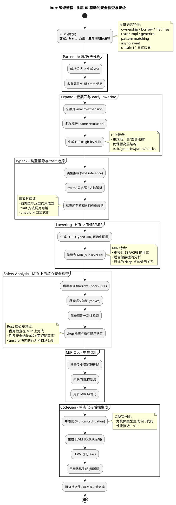

# Rust完整架构与核心机制

## 概述

同样面对“空间安全、时间安全、初始化安全、空指针解引用、类型安全和并发安全”这六类问题，Rust 的总体思路可以概括为：

> **把“安全”作为语言语义的一部分**：在类型系统与中间表示（IR）上持续携带可验证的信息，并用“unsafe 边界”把不可证明的行为集中封装、显式标注，最大化把风险压缩到可审计的局部。

与 BishengC “几乎全部安全语义集中在 Clang 前端、在 CodeGen 处抹去”不同，Rust 的安全机制在编译链路中**跨越多层 IR 持续生效**，尤其在 **HIR/MIR** 层完成大量关键检查与变换，最后才落到 LLVM IR 做通用优化与后端生成。

---

## 已实现的安全机制

### 1) 时间安全（完整实现，默认安全）

* **UAF / Double Free / 悬空指针 / 内存泄漏（资源未释放）**
  通过 **所有权（Ownership）+ 借用（Borrowing）+ 生命周期（Lifetimes）** 的静态约束实现：

  * 值的移动语义（move）确保“唯一所有者”可追踪
  * 借用规则保证引用不会越过所有者生命周期
  * RAII/Drop 确保离开作用域自动释放资源（包括内存、文件句柄、锁等）

**什么是生命周期（Lifetimes）？**

生命周期是Rust中用于追踪**引用有效期**的类型系统机制：

```rust
// 显式生命周期标注
fn longest<'a>(x: &'a str, y: &'a str) -> &'a str {
    if x.len() > y.len() { x } else { y }
}
// 'a 表示：返回值的有效期 = min(x的有效期, y的有效期)

// 使用示例
let s1 = String::from("long");
let result;
{
    let s2 = String::from("short");
    result = longest(&s1, &s2);  // ❌ 编译错误！
}  // s2在这里销毁，但result还引用它
println!("{}", result);  // 悬空指针！
```

**编译器如何利用生命周期？**

1. **在MIR上具体化**：抽象的`'a`在MIR中变成具体的region（作用域范围）
2. **借用检查器验证**：确保所有引用在其指向对象被销毁前失效
3. **编译时保证**：上述错误在编译期被拒绝，运行时不会出现悬空指针

**BishengC vs Rust的生命周期对比：**

| 特性 | BishengC | Rust |
|-----|---------|------|
| **生命周期追踪** | 隐式（通过Scope和CFG分析） | 显式（`'a`标注+编译器推导） |
| **跨函数传播** | 受限（前端CFG分析能力有限） | 完整（在MIR上全局分析） |
| **错误诊断** | 可能运行时才暴露 | 编译期精确定位 |
| **语法要求** | 无需标注 | 复杂情况需手动标注`'a` |

**示例对比：**

```c
// BishengC（假设有类似代码）
char* borrow get_first(int* borrow arr, size_t len) {
    if (len > 0) return &arr[0];
    return NULL;
}
// 编译器通过Scope隐式推断arr的生命周期，但跨函数分析较弱

// Rust
fn get_first<'a>(arr: &'a [i32]) -> Option<&'a i32> {
    arr.first()
}
// 显式标注'a，编译器在MIR上验证：返回值的生命周期 <= arr的生命周期
```

**总结**：Rust的生命周期是**类型系统的一部分**，编译器在MIR层完整验证。BishengC依赖前端隐式推断，覆盖能力有限
> 注意：Rust 的“内存泄漏”在语义上通常指“资源不再可达但未释放”。安全 Rust 很难“意外泄漏”，但仍可以通过显式手段（如 `mem::forget`）刻意泄漏；这属于可控的“逃逸口”。

### 2) 初始化安全（完整实现，默认安全）

* **未初始化变量使用**：编译器强制“必须初始化后才能使用”，并在控制流上进行可达性与赋值状态分析
* 模式匹配、`let` 绑定、`match` 的穷尽性检查也强化了“所有路径被覆盖”的初始化与赋值安全

### 3) 空指针解引用（语言级消解）

* **引用类型 `&T / &mut T` 在语义上不可为空**（不存在“空引用”）
* 需要表达“可空”时使用 `Option<&T>` / `Option<Box<T>>` 等显式类型
* 这把“空指针风险”从运行时错误，转成 **类型层面的显式分支处理**

### 4) 类型安全（完整实现，默认安全）

* 强类型系统、泛型与 trait 约束、模式匹配穷尽性、不可变/可变区分
* 绝大多数“未定义行为（UB）”入口被限制在 `unsafe` 中：

  * 裸指针解引用、越界访问的绕过、别名规则突破等

### 5) 并发安全（语言级核心能力，默认安全）

* Rust 不仅关心“单线程内存安全”，也把 **数据竞争（data race）** 视为内存安全的一部分来处理：

  * `Send/Sync` 自动推导 + trait 约束，把“能否跨线程移动/共享”变成类型可证明命题
  * 所有权与借用规则在并发场景下依然成立（共享要么不可变，要么通过同步原语/原子类型）

### 6) 空间安全（默认安全，但包含显式逃逸口）

* **安全 Rust 的数组/切片访问默认做边界检查**（运行时检查），从而阻止大多数越界读写
* 但在 `unsafe` 中可以使用裸指针或 `get_unchecked` 等方式绕过检查
* 所以空间安全在 Rust 中是：**安全子集强保证 + unsafe 显式承担责任**

---

## 整体架构设计

Rust 的编译器（rustc）之所以“分层 IR 多”，核心目的有三个：

1. **把高层语义逐步“降级”成更适合分析/优化的形式**（宏、trait、泛型、模式匹配等需要专门的承载层）
2. **在更合适的层做更合适的检查**（例如借用检查在 MIR 上更稳定）
3. **把语言级安全结论转换成可优化的中间事实**（例如别名信息、可变性、drop 时机等）

> 简化理解：
>
> * **AST/HIR** 更贴近“人写的代码结构与语义”
> * **MIR** 更贴近“机器可分析的控制流与数据流”
> * **LLVM IR** 更贴近“后端通用优化与指令选择”

---

## 编译流程概览（同风格 PlantUML）



**关键阶段说明：**

* **Expand/Typeck**：解决“语言层高语义”（宏、trait、泛型、名字解析），并形成稳定的 HIR
* **MIR**：Rust 安全机制的“主战场”——借用检查、NLL、drop 语义等在 MIR 上完成
* **CodeGen**：泛型单态化后才下沉到 LLVM IR；最终产物是标准 LLVM IR（但 Rust 的许多安全结论已经在更早阶段保证）

**时间线：**

```
源代码 → AST → HIR → (THIR) → MIR → LLVM IR → 机器码
                 ↑______________↑
           语义与安全检查的核心层（类型/借用/生命周期）
```

---
