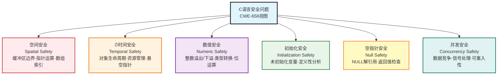

# C语言内存安全问题分类与CWE映射

## 引言：从内存机制到安全漏洞

在第二章中，我们学习了C程序运行时的内存布局：栈用于函数调用和局部变量，堆用于动态内存分配，数据段和BSS段存储全局变量，代码段存储机器指令。每个内存区域都有其特定的管理方式和生命周期规则。

在第三章中，我们掌握了C语言控制内存的语法工具：`static`/`extern`决定变量的存储位置和链接属性，`const`/`volatile`控制访问权限，指针提供了直接操作内存地址的能力。这些语法特性赋予了C语言极高的灵活性和性能。

然而，**强大的控制能力也意味着更高的出错风险**。C语言"零成本抽象"的设计哲学——不为不需要的功能付费——将内存安全的责任完全交给了程序员。当程序员犯错时，这些错误会转化为可被利用的安全漏洞。

这些安全问题在软件工程实践中已被**MITRE的CWE（Common Weakness Enumeration，通用弱点枚举）**体系系统化分类。本章采用**CWE-658（Weaknesses in Software Written in C）**视图来组织和分析这些问题——这是CWE官方专门针对C语言程序的漏洞分类视图，涵盖了**103个C语言特有的弱点**（而非所有编程语言共有的问题）。选择此视图的原因是：它精准聚焦于"C语言设计特性导致的安全问题"，而非通用的编程错误，这与本章的主题完美契合。

### CWE-658 中的问题筛选原则

从CWE-658的103个弱点分类中，本章重点关注**Base级别**的问题。在CWE的抽象层次体系中，Base是"抽象程度适中、稳定、可跨多个变体的核心弱点"，既不像Pillar过于抽象（如"内存损坏"），也不像Variant过于具体（如"strcpy缓冲区溢出"）。Base级别的CWE适合作为安全编译器和语言改造的设计目标，因为它们代表了**可通过编译器技术系统化解决的根本问题**。

根据学术界对内存安全的经典分类，属于“语言级内存与资源安全能力”的评测维度。本章将选出的Base级CWE归纳为以下维度：



#### 空间安全 / 内存边界类

- **CWE-119**: Improper Restriction of Operations within the Bounds of a Memory Buffer（内存缓冲区边界操作限制不当）
  - **CWE-125**: Out-of-bounds Read（越界读取）
    - **CWE-126 (variant)**: Buffer Over-read（缓冲区过度读取）
    - **CWE-127 (variant)**: Buffer Under-read（缓冲区欠读取）
  - **CWE-787**: Out-of-bounds Write（越界写入）
    - **CWE-120**: Buffer Copy without Checking Size of Input（未检查输入大小的缓冲区拷贝）— 经典缓冲区溢出
    - **CWE-121 (variant)**: Stack-based Buffer Overflow（基于栈的缓冲区溢出）— 同时涉及越界写入和读取
    - **CWE-122 (variant)**: Heap-based Buffer Overflow（基于堆的缓冲区溢出）— 同时涉及越界写入和读取
    - **CWE-123**: Write-what-where Condition（任意地址写入）
    - **CWE-124**: Buffer Underwrite（缓冲区下溢，向起始地址之前写入）
  - **CWE-788**: Access of Memory Location After End of Buffer（访问缓冲区末尾之后的内存）
  - **CWE-805**: Buffer Access with Incorrect Length Value（使用错误长度值访问缓冲区）
  - **CWE-823**: Use of Out-of-range Pointer Offset（使用越界的指针偏移量）
    - **CWE-129 (variant)**: Improper Validation of Array Index（数组索引验证不当，导致读越界）

- 其他空间安全问题

  - **CWE-128**: Wrap-around Error（整数回绕错误，用于地址/长度计算）
  - **CWE-130**: Improper Handling of Length Parameter Inconsistency（长度参数不一致处理不当）
  - **CWE-131**: Incorrect Calculation of Buffer Size（缓冲区大小计算错误）
    - **CWE-467 (variant)**: Use of sizeof() on a Pointer Type（对指针类型使用sizeof()）
  - **CWE-134**: Use of Externally-Controlled Format String（使用外部可控格式化字符串）
  - **CWE-135**: Incorrect Calculation of Multi-Byte String Length（多字节字符串长度计算错误）
  - **CWE-170**: Improper Null Termination（字符串未正确以NULL结尾）
    - **CWE-158 (variant)**: Improper Neutralization of Null Byte or NUL Character（NUL字节未正确中和/过滤）
  - **CWE-188**: Reliance on Data/Memory Layout（依赖特定的数据或内存布局假设）
  - **CWE-193**: Off-by-one Error（边界偏一错误）
  - **CWE-468**: Incorrect Pointer Scaling（指针缩放计算错误）
  - **CWE-469**: Use of Pointer Subtraction to Determine Size（使用指针相减确定大小）
  - **CWE-786**: Access of Memory Location Before Start of Buffer（访问缓冲区起始位置之前的内存）
  - **CWE-822**: Untrusted Pointer Dereference（对不可信指针进行解引用）
    - **CWE-587**: Assignment of a Fixed Address to a Pointer（将固定地址赋值给指针）


#### 时间安全 / 生命周期类
- **【Initialization Safety（初始化阶段）】**
  - **CWE-457**: Use of Uninitialized Variable（使用未初始化变量）
  - **CWE-824**: Access of Uninitialized Pointer（访问未初始化指针）
- **【Lifetime End Safety（生命周期是否被正确结束）】**
  - **CWE-244（variant)**: Improper Clearing of Heap Memory Before Release (释放前未正确清空堆内存，可能导致敏感信息残留与泄露）)
  - **CWE-401(variant)**: Missing Release of Memory after Effective Lifetime（对象生命周期结束后未释放内存，导致内存泄漏）
  - **CWE-763**: Release of Invalid Pointer or Reference（释放无效指针或引用）
    - **CWE-590 (variant)**: Free of Memory not on the Heap（释放非堆上的内存）
  - **CWE-1341**: Multiple Releases of Same Resource or Handle（对同一资源或句柄的多次释放）
- **【Use-after / Expired生命周期结束之后，是否还有人继续使用】**
  - **CWE-825**: Expired Pointer Dereference（访问已过期指针）
    - **CWE-416 (variant)**: Use After Free（释放后使用）
  - **CWE-910**: Use of Expired File Descriptor（使用已失效的文件描述符）
- **【Ownership / Escape一个对象的ownership是否被不当地‘逃逸’到了不该掌控它的地方】**
  - **CWE-374**: Passing Mutable Objects to an Untrusted Method（将可变对象传递给不可信方法）
  - **CWE-375**: Returning a Mutable Object to an Untrusted Caller（将可变对象返回给不可信调用者）
  - **CWE-466**: Return of Pointer Value Outside of Expected Range（返回超出预期范围的指针值）
  - **CWE-562**: Return of Stack Variable Address（返回栈变量地址）
  - **CWE-495 (variant)**: Private Data Structure Returned From A Public Method（公共方法返回私有数据结构/内部表示，导致封装泄露与可变性逃逸）
  - **CWE-496 (variant)**: Public Data Assigned to Private Array-Typed Field
    （将外部数据引用写入私有数组字段，导致隐式控制权逃逸）
- **CWE-403**: Exposure of File Descriptor to Unintended Control Sphere（文件描述符泄漏）
- **CWE-460**: Improper Cleanup on Thrown Exception（异常路径中清理不当）
- **CWE-911**: Improper Update of Reference Count（引用计数更新不当）
- **CWE-1325**: Improperly Controlled Sequential Memory Allocation（顺序内存分配控制不当）

  - **CWE-415（variant)**: Double Free（重复释放）

#### 数值安全类

- **CWE-190**: Integer Overflow or Wraparound（整数溢出或回绕）
- **CWE-191**: Integer Underflow（整数下溢）
- **CWE-197**: Numeric Truncation Error（数值截断错误）
- **CWE-839**: Numeric Range Comparison Without Minimum Check（数值范围比较缺少下界检查）
- **CWE-1335**: Incorrect Bitwise Shift of Integer（整数位移操作错误）

#### 类型安全类

- **CWE-704**: Incorrect Type Conversion or Cast（不正确的类型转换）
  - **CWE-588 (variant)**: Attempt to Access Child of a Non-structure Pointer（尝试访问非结构体指针的成员）
  - **CWE-681**: Incorrect Conversion between Numeric Types（数值类型之间的错误转换）
    - **CWE-192 (variant)**: Integer Coercion Error（整数强制转换错误）
    - **CWE-194 (variant)**: Unexpected Sign Extension（意外的符号扩展）
    - **CWE-195 (variant)**: Signed to Unsigned Conversion Error（有符号到无符号转换错误）
    - **CWE-196 (variant)**: Unsigned to Signed Conversion Error（无符号到有符号转换错误）

#### 并发安全 / 语言语义类

- **CWE-362**: Concurrent Execution using Shared Resource with Improper Synchronization（使用共享资源的并发执行中同步不当，即"竞态条件"）
  - **CWE-364**: Signal Handler Race Condition（信号处理器中的竞态条件）
  - **CWE-366**: Race Condition within a Thread（单线程内的竞态条件）

##### 其他并发安全问题

- **CWE-663**: Use of a Non-reentrant Function in a Concurrent Context（并发环境中使用不可重入函数）
  - **CWE-479 (variant)**: Signal Handler Use of a Non-reentrant Function（信号处理器中使用不可重入函数）
  - **CWE-558 (variant)**: Use of getlogin() in Multithreaded Application（多线程应用中使用getlogin()）

#### 语义 / 编译器 / 其他类

- **CWE-242**: Use of Inherently Dangerous Function（使用本质上危险的函数）
- **CWE-243**: Creation of chroot Jail Without Changing Working Directory（创建 chroot 隔离环境但未切换当前工作目录，可能导致隔离逃逸）
- **CWE-474**: Use of Function with Inconsistent Implementations（使用实现不一致的函数）
- **CWE-476**: NULL Pointer Dereference（空指针解引用）
- **CWE-478**: Missing Default Case in Multiple Condition Expression（多分支条件缺少默认分支）
- **CWE-480**: Use of Incorrect Operator（使用错误的运算符）
  - **CWE-481 (variant)**: Assigning instead of Comparing（使用赋值运算符而非比较运算符）
  - **CWE-482 (variant)**: Comparing instead of Assigning（使用比较运算符而非赋值运算符）
- **CWE-483**: Incorrect Block Delimitation（代码块边界错误）
- **CWE-484**: Omitted Break Statement in Switch（switch语句中遗漏break）
- **CWE-617**: Reachable Assertion（可达断言）
- **CWE-733**: Compiler Optimization Removal or Modification of Security-critical Code（编译器优化移除或修改安全关键代码）
  - **CWE-14**: Compiler Removal of Code to Clear Buffers（编译器移除清除缓冲区的代码）
- **CWE-783**: Operator Precedence Logic Error（运算符优先级逻辑错误）
- **CWE-1429**: Missing Feedback on Unexecuted Security-Related Hardware Operation（未对未执行的安全相关硬件操作提供反馈）


## A. 空间安全问题深度剖析

### 核心问题：为什么C语言缺乏空间安全能力？

**CWE-119及其子类**（CWE-120/121/122/123/124/125/787/788/805/823）共同指向一个根本性设计缺陷：**C语言不检查内存访问边界**。这不是疏忽，而是C语言"零成本抽象"哲学的核心体现。

#### 1. 技术根源：数组即指针

C语言将数组访问转换为纯指针运算：

```c
int arr[10];
int x = arr[5];  // 等价于: *(arr + 5)
```

这意味着：
- `arr[5]` 被编译为 `*(arr + 5)`，即"基地址 + 5 × sizeof(int)"
- CPU执行的是**纯粹的算术运算 + 内存读取**，没有任何边界检查逻辑
- 编译器不生成任何"if (index < 10)"的判断代码

**为什么不检查？**

如果每次数组访问都检查边界，意味着：

```c
// 原始代码
for (int i = 0; i < 1000000; i++) {
    sum += arr[i];
}

// 如果强制边界检查，等价于：
for (int i = 0; i < 1000000; i++) {
    if (i >= 0 && i < arr_length) {  // 每次循环额外2次比较
        sum += arr[i];
    } else {
        handle_error();  // 异常处理开销
    }
}
```

**性能影响**：
- 每次数组访问增加 2-4 条机器指令（边界比较、条件跳转）
- 循环密集型代码性能可能降低 **20-50%**
- 现代CPU的分支预测失败会导致流水线停顿（10-20个时钟周期）

#### 2. 各类越界问题的本质

##### CWE-787/788：越界写入/读取（Out-of-bounds Write/Read）

```c
char buffer[64];
// CWE-787: 越界写入
buffer[100] = 'A';  // 写入buffer外的内存，可能覆盖相邻变量

// CWE-788: 越界读取  
char c = buffer[100];  // 读取buffer外的内存，可能泄露敏感信息
```

**危害**：
- **写入**：破坏相邻内存布局，如覆盖函数返回地址（栈溢出攻击）、堆元数据（堆溢出攻击）
- **读取**：信息泄露，如读取密钥、密码等敏感数据

##### CWE-121/122：栈/堆缓冲区溢出（Stack/Heap Buffer Overflow）

```c
// CWE-121: 栈溢出
void vulnerable() {
    char buffer[64];
    strcpy(buffer, user_input);  // user_input长度>64，覆盖栈上的返回地址
}

// CWE-122: 堆溢出
char *data = malloc(64);
memcpy(data, user_input, user_len);  // user_len>64，覆盖堆元数据
```

**为什么危险？**

栈布局示例（栈向下增长）：
```
高地址
  ┌──────────────┐
  │ 返回地址      │ ← 函数返回时跳转到这里
  ├──────────────┤
  │ 旧栈帧指针    │
  ├──────────────┤
  │ buffer[63]   │
  │     ...      │
  │ buffer[0]    │ ← 如果strcpy溢出，向上覆盖返回地址
  └──────────────┘
低地址
```

攻击者通过精心构造输入，使溢出数据覆盖返回地址，跳转到恶意代码。

##### CWE-120：未检查大小的缓冲区拷贝

```c
char dest[10];
strcpy(dest, source);  // strcpy不检查source长度！
```

**危险函数家族**：
- `strcpy(dest, src)` → 应该用 `strncpy(dest, src, sizeof(dest))`
- `gets(buffer)` → 应该用 `fgets(buffer, size, stdin)`
- `sprintf(buffer, fmt, ...)` → 应该用 `snprintf(buffer, size, fmt, ...)`

这些函数的共同特点：**不知道目标缓冲区的大小**，完全依赖程序员保证源数据不会超出目标容量。

##### CWE-124：缓冲区下溢（Buffer Underwrite）

```c
char buffer[64];
buffer[-1] = 'A';  // 向buffer起始地址之前写入
```

负数索引在C语言中是合法的语法（因为只是指针运算），但会访问缓冲区之前的内存，可能破坏前面的变量或堆元数据。

##### CWE-123：任意地址写入（Write-what-where）

```c
void unsafe_write(int *ptr, int value) {
    *ptr = value;  // 如果ptr被攻击者控制，可写入任意地址
}

// 攻击场景
int *evil_ptr = (int*)0x12345678;  // 攻击者指定的地址
unsafe_write(evil_ptr, 0xdeadbeef);  // 向该地址写入数据
```

这是最危险的漏洞类型之一，攻击者可以修改函数指针、GOT表项等关键数据结构，实现任意代码执行。

##### CWE-805/823：长度错误与越界偏移

```c
// CWE-805: 使用错误的长度值
char buffer[64];
memcpy(buffer, source, 128);  // 长度参数错误，应该是64

// CWE-823: 使用越界的指针偏移
char *ptr = buffer;
char c = *(ptr + 100);  // 偏移量超出buffer范围
```

#### 3. C语言为何选择"不安全"？

**设计哲学**：C语言的目标是"可移植的汇编语言"，需要：

1. **零抽象开销**：数组访问应该与汇编的"加载"指令一样快
2. **完全的硬件控制**：程序员需要能够访问任意内存地址（如设备寄存器映射）
3. **性能可预测性**：不能有隐藏的运行时检查

**性能数据**：
- **Rust**（强制边界检查）：在release模式下通过优化消除大部分检查，但仍有5-15%的性能开销
- **Java**（强制边界检查 + 异常处理）：数组访问比C慢约20-30%
- **Python**（动态类型 + 边界检查）：数组操作比C慢100-1000倍

**C语言的选择**：
- ✅ **性能优势**：零开销的数组访问，适合系统编程、嵌入式、实时系统
- ❌ **安全代价**：程序员必须手动验证所有边界，一旦遗漏即成漏洞
- **妥协方案**：提供安全函数（strncpy、snprintf），但不强制使用

#### 4. 现代缓解技术

虽然C语言本身不提供边界检查，但现代系统通过其他手段缓解：

**编译器技术**：
- **Stack Canary**（栈保护）：在返回地址前插入随机值，检测栈溢出
- **FORTIFY_SOURCE**：编译时替换危险函数为安全版本
- **AddressSanitizer**（ASan）：运行时检测越界访问（性能开销70%）

**操作系统保护**：
- **ASLR**（地址空间布局随机化）：随机化栈、堆、代码段地址，增加攻击难度
- **DEP/NX**（数据执行保护）：标记栈和堆为不可执行，阻止shellcode执行
- **RELRO**：保护GOT表，防止任意地址写入篡改函数指针

**硬件支持**：
- **Intel MPX**（Memory Protection Extensions）：硬件边界检查（已废弃，性能开销过大）
- **ARM MTE**（Memory Tagging Extension）：标记指针和内存，检测UAF和越界

**这些缓解技术的局限性**：
- 只能**检测**部分攻击，无法**阻止**所有越界访问
- 存在绕过手段（如ROP攻击链）
- 性能开销不可接受（ASan降低70%性能）

---

### 总结：空间安全的根本矛盾

C语言的空间不安全是其**本质特征**，不是可修复的缺陷：

1. **技术层面**：数组 = 指针运算，CPU无法判断地址有效性
2. **性能层面**：边界检查会显著降低性能（20-50%）
3. **哲学层面**：C选择"零成本抽象"，将安全责任交给程序员
4. **历史层面**：C诞生于1972年，当时安全不是设计重点

**为什么现代语言都在修复这个问题？**

因为实践证明，**程序员无法100%正确地管理边界**。即使经验丰富的C程序员，也难免在复杂代码中犯错。因此：

- **Rust**：编译时所有权检查 + 运行时边界检查（release模式优化掉大部分）
- **Go**：运行时强制边界检查 + panic机制
- **Swift/Kotlin**：数组自带长度信息，访问时强制检查

C语言的"不安全"设计不是缺陷，而是其作为"可移植汇编语言"的本质特征。理解这一点，是学习现代安全语言设计的基础。